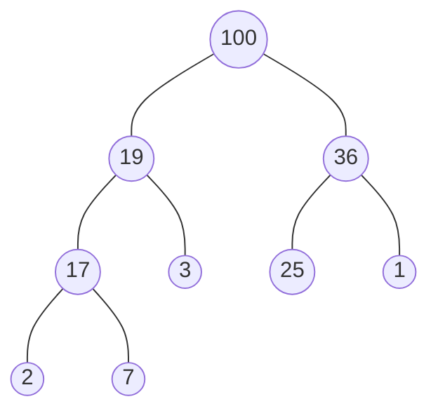
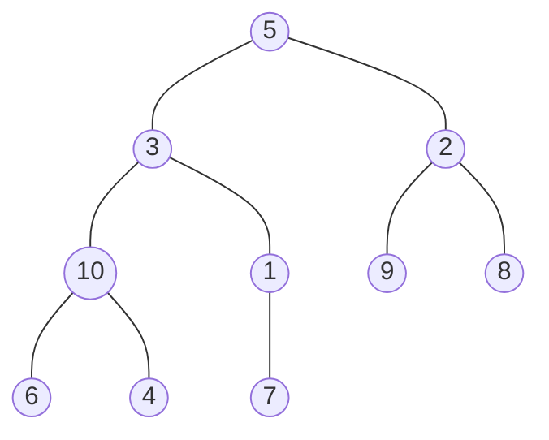
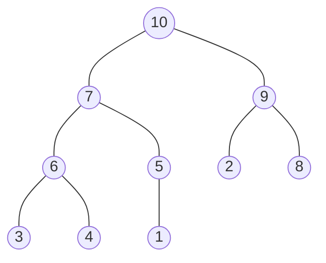

## Heap



- 完全二元樹 (complete binary tree)
  - 由上至下，由左至右依順序加入節點
  - 若節點非葉節點，則一定擁有兩個子節點
- 所有父節點大於子節點，稱為最大堆積 (max-heap)，反之所有父節點小於子節點，稱為最小堆積 (min-heap)
- 上圖 max-heap 以陣列表示為 `[100, 19, 36, 17, 3, 25, 1, 2, 7]{:js}`
  - 假設父節點 index 為 `n`，左子節點 index 為 `2n + 1`，右子節點 index 為 `2n + 2` 

## Heapify

將無序數列轉換成 heap 的過程稱為 heapify

以 `[5, 3, 2, 10, 1, 9, 8, 6, 4, 7]{:js}` 為例：



轉換成 max-heap 為： `[10, 7, 9, 6, 5, 2, 8, 3, 4, 1]{:js}`



程式碼實作流程如下：

1. 從最後一個父節點開始 (L4)
1. 先找出左、右子節點的 index (L9-10)
1. 比較父節點、左子節點、右子節點的值，暫存最大值的 index (L12-20)
1. 如果父節點 index，與最大值 index 不同 (L22)
    1. 互換兩者位置 (L24-25)
    1. 對更新後的子節點，再進行一次 heapify (L26)

```js showLineNumbers
// create max-heap
const nums = [5, 3, 2, 10, 1, 9, 8, 6, 4, 7];

for (let i = Math.floor(nums.length / 2) - 1; i >= 0; i--) {
  maxHeapify(nums, i, nums.length);
}

function maxHeapify(array, index, heapSize) {
  const leftIndex = 2 * index + 1;
  const rightIndex = 2 * index + 2;

  let largestValueIndex = index;
  
  if (heapSize > leftIndex && array[largestValueIndex] < array[leftIndex]) {
    largestValueIndex = leftIndex;
  }
  
  if (heapSize > rightIndex && array[largestValueIndex] < array[rightIndex]) {
    largestValueIndex = rightIndex;
  }
  
  if (index !== largestValueIndex) {
    const largest = array[largestValueIndex];
    array[largestValueIndex] = array[index];
    array[index] = largest;
    maxHeapify(array, largestValueIndex, heapSize);
  }
}
```

## Heap Sort

1. 將序列轉換為 max-heap 結構 (L4-6)
1. max-heap 第一筆元素為最大值，將第一筆與最後一筆元素對調，即完成一筆排序 (L9-11)
1. 對未排序元素，重新進行 max-heapify (L12)
1. 持續步驟 2、步驟 3，直到排序完成

```js showLineNumbers
heapSort([5, 3, 2, 10, 1, 9, 8, 6, 4, 7]);

function heapSort(array) {
  for (let i = Math.floor(array.length / 2) - 1; i >= 0; i--) {
    maxHeapify(array, i, array.length);
  }
  
  for (let i = array.length - 1; i > 0; i--) {
    const lesser = array[i];
    array[i] = array[0];
    array[0] = lesser;
    maxHeapify(array, 0, i);
  }
  
  return array;
}

function maxHeapify(array, index, heapSize) {
  const leftIndex = 2 * index + 1;
  const rightIndex = 2 * index + 2;
  let largestValueIndex = index;
  
  if (heapSize > leftIndex && array[largestValueIndex] < array[leftIndex]) {
    largestValueIndex = leftIndex;
  }
  
  if (heapSize > rightIndex && array[largestValueIndex] < array[rightIndex]) {
    largestValueIndex = rightIndex;
  }
  
  if (index !== largestValueIndex) {
    const largest = array[largestValueIndex];
    array[largestValueIndex] = array[index];
    array[index] = largest;
    maxHeapify(array, largestValueIndex, heapSize);
  }
}
```

## Reference

- [Build-Max-Heap: Why Start i at floor(A.length/2) rather than A.length?](https://cs.stackexchange.com/questions/71786/build-max-heap-why-start-i-at-floora-length-2-rather-than-a-length)
- [堆積排序 Heapsort](https://rust-algo.club/sorting/heapsort/)
- [Complete Intro to Computer Science - Heap Sort](https://btholt.github.io/complete-intro-to-computer-science/heap-sort)
