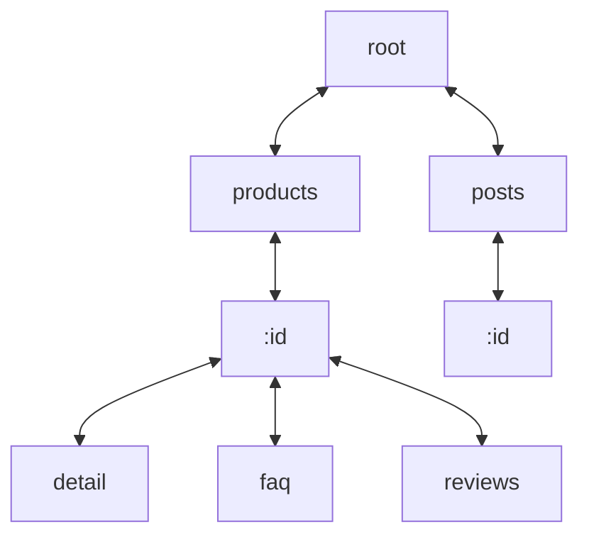

import { Callout } from 'nextra/components'

[radix3](https://github.com/unjs/radix3) 是一個輕量級的 router 實作，這裡參考的 [commit](https://github.com/unjs/radix3/tree/293d3ae4d0d8719e4df62d921b2effdc2dc4567a) 版本為 `v1.1.2`

## Tree structure

基於 [radix tree](https://zh.wikipedia.org/zh-tw/%E5%9F%BA%E6%95%B0%E6%A0%91) 結構，將共同的前綴作為父節點，藉此來降低樹的高度

以下方的 paths 為例，在 radix3 大致的樹狀結構如下：

- `/products`
- `/products/:id`
- `/products/:id/detail`
- `/products/:id/faq`
- `/products/:id/reviews`
- `/posts`
- `/posts/:id`



## Node.children

- 節點上的 `children` 屬性為儲存子節點的 map，key 為該子節點對應的字串
- 新增節點時的 `path.split('/'){:js}`，以 `/products/:id` 為例，即為 `['', 'products', ':id']{:js}`
- `for (const section of sections){:js}`，`section` 順序與樹高有對應關係，所以依序從 `rootNode` 開始，透過 `children.get(section){:js}` 向下遍歷

```ts
function insert(ctx: RadixRouterContext, path: string, data: any) {
  // skip
  const sections = path.split('/');
  
  let node = ctx.rootNode;
  for (const section of sections) {
    let childNode: RadixNode<RadixNodeData> | undefined;
    
    if ((childNode = node.children.get(section))) {
      node = childNode;
    } else {
      // skip
      childNode = createRadixNode(/* skip */);
      node.children.set(section, childNode);
      node = childNode;
    }
  }
  // skip
}
```

## Node.type

節點上的 `type` 屬性，表示對應的路徑規則

`type` 在新增節點時計算，主要用來推斷節點上另一個 `paramName` 屬性，`paramName` 與 `const data = router.lookup(path){:js}` 搜尋動態路徑回傳的 `data.params` 格式相關
 
```ts
const NODE_TYPES = {
  NORMAL: 0,
  WILDCARD: 1,
  PLACEHOLDER: 2,
} as const;
```

- `NORMAL`：靜態比對的節點，例如：`/foo`, `/foo/bar`
- `WILDCARD`：支援 multi level of sub routes 的節點，例如：`/foo/**`
- `PLACEHOLDER`：支援 named/unamed params 的節點，例如：`/foo/*`, `/hello/:name`

<Callout type="info">
  補充：v2 的 `NODE_TYPES` 會新增 `MIXED`，細節可以參考：[Support mixing dynamic params with static string in same segment#11](https://github.com/unjs/radix3/issues/11), [#pull52](https://github.com/unjs/radix3/pull/52)
</Callout>

## RouterContext.staticRoutesMap

`router.ctx.staticRoutesMap` 是一個 key 為完整靜態路徑，value 為對應節點的物件

新增節點時，如果該路徑為靜態路徑，同時也會在 `router.ctx.staticRoutesMap` 新增一筆對應的資料，後續在 `router.lookup(path)` 搜尋靜態路徑，如果 `staticRoutesMap[path]` 有資料就提前回傳，藉此節省遍歷 tree 及判斷是否計算 `data.params` 的開銷

```ts
function insert(ctx: RadixRouterContext, path: string, data: any) {
  let isStaticRoute = true;
  let node = ctx.rootNode;
  const sections = path.split("/");

  for (const section of sections) {
    let childNode: RadixNode<RadixNodeData> | undefined;

    if ((childNode = node.children.get(section))) {
      node = childNode;
    } else {
      const type = getNodeType(section);
      childNode = createRadixNode({ type, parent: node });
      node.children.set(section, childNode);

      if (type === NODE_TYPES.PLACEHOLDER) {
        // skip
        isStaticRoute = false;
      } else if (type === NODE_TYPES.WILDCARD) {
        // skip
        isStaticRoute = false;
      }
      node = childNode;
    }
  }
  // Optimization, if a route is static and does not have any
  // variable sections, we can store it into a map for faster retrievals
  if (isStaticRoute === true) {
    ctx.staticRoutesMap[path] = node;
  }

  return node;
}
```

## Reference

- [radix3](https://github.com/unjs/radix3)
- [radix tree](https://zh.wikipedia.org/zh-tw/%E5%9F%BA%E6%95%B0%E6%A0%91)
