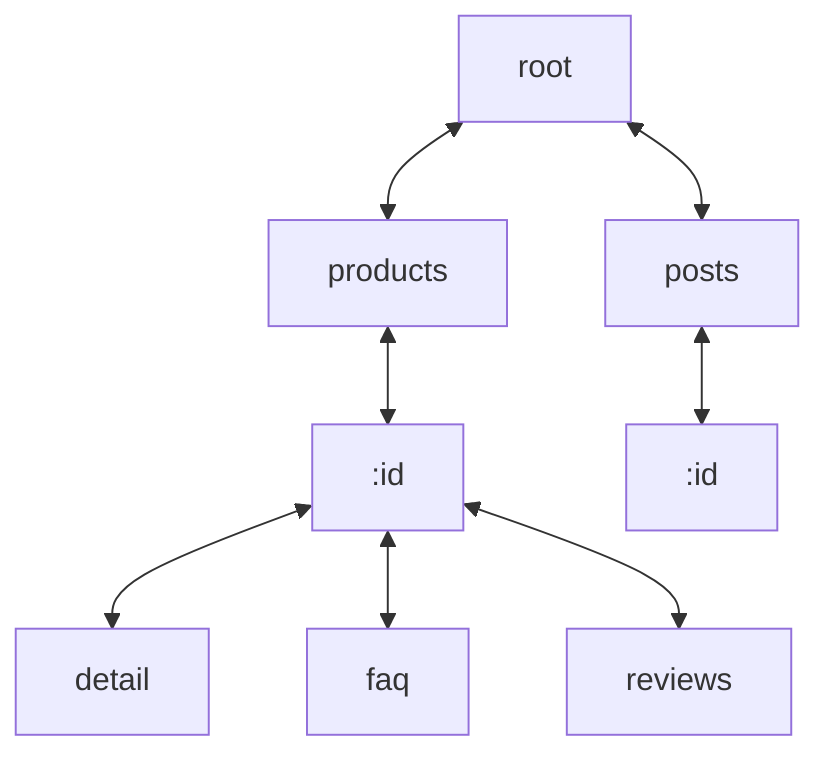

import { Callout } from 'nextra/components'

[radix3](https://github.com/unjs/radix3) 是一個輕量級的 router 實作，這裡參考的 [commit](https://github.com/unjs/radix3/tree/293d3ae4d0d8719e4df62d921b2effdc2dc4567a) 版本為 `v1.1.2`

```ts
import { createRouter } from 'radix3';

const router = createRouter(/* options */);

// insert routes
router.insert('/path', { payload: 'this path' });
router.insert('/path/:name', { payload: 'named route' });
router.insert('/path/foo/**', { payload: 'wildcard route' });
router.insert('/path/bar/**:name', { payload: 'named wildcard route' });

// match route to access matched data
router.lookup('/path');
// { payload: 'this path' }

router.lookup('/path/fooval');
// { payload: 'named route', params: { name: 'fooval' } }

router.lookup('/path/foo/bar/baz');
// { payload: 'wildcard route', params: { _: 'bar/baz' } }

router.lookup('/path/bar/fooval');
// { payload: 'named wildcard route', params: { name: 'fooval' } }

router.lookup('/');
// null (no route matched for/)
```

## Tree structure

基於 [radix tree](https://zh.wikipedia.org/zh-tw/%E5%9F%BA%E6%95%B0%E6%A0%91) 結構，將共同的前綴作為父節點，藉此來降低樹的高度

以下方的 paths 為例，在 radix3 大致的樹狀結構如下：

- `/products`
- `/products/:id`
- `/products/:id/detail`
- `/products/:id/faq`
- `/products/:id/reviews`
- `/posts`
- `/posts/:id`



## Node.children

節點上的 `children` 屬性為儲存子節點的 map，key 為該子節點對應的字串

如何遍歷 tree 與 `children` 及輸入的路徑相關，以新增 `/products/:id` 節點為例：

- `const sections = path.split('/'){:js}` 即為 `['', 'products', ':id']{:js}`
- `for (const section of sections){:js}`，`section` 順序與樹高有對應關係，所以依序從 `rootNode` 開始，透過 `children.get(section){:js}` 向下遍歷

```ts showLineNumbers
function insert(ctx: RadixRouterContext, path: string, data: any) {
  const sections = path.split('/');
  let node = ctx.rootNode;

  for (const section of sections) {
    let childNode: RadixNode<RadixNodeData> | undefined;
    
    if ((childNode = node.children.get(section))) {
      node = childNode;
    } else {
      const type = getNodeType(section);
      // Create new node to represent the next part of the path
      childNode = createRadixNode({ type, parent: node });
      node.children.set(section, childNode);
      // skip
      node = childNode;
    }
  }
  // skip
}
```

## Node.type

- `NORMAL`：靜態比對的節點，例如：`/foo`, `/foo/bar`
- `WILDCARD`：支援 multi level of sub routes 的節點，例如：`/foo/**`
- `PLACEHOLDER`：支援 named/unamed params 的節點，例如：`/foo/*`, `/hello/:name`
 
```ts
const NODE_TYPES = {
  NORMAL: 0,
  WILDCARD: 1,
  PLACEHOLDER: 2,
} as const;
```

<Callout type="info">
  補充：v2 的 `NODE_TYPES` 會新增 `MIXED`，細節可以參考：[Support mixing dynamic params with static string in same segment#11](https://github.com/unjs/radix3/issues/11), [#pull52](https://github.com/unjs/radix3/pull/52)
</Callout>

`type` 在新增節點時計算，主要用來推斷節點上的其他屬性，與 `const data = router.lookup(path){:js}` 搜尋動態路徑，回傳的 `data.params` 格式相關

```ts showLineNumbers, {4, 12, 17-26}
function insert(ctx: RadixRouterContext, path: string, data: any) {
  const sections = path.split("/");
  let node = ctx.rootNode;
  let _unnamedPlaceholderCtr = 0;

  for (const section of sections) {
    let childNode: RadixNode<RadixNodeData> | undefined;

    if ((childNode = node.children.get(section))) {
      node = childNode;
    } else {
      const type = getNodeType(section);
      // Create new node to represent the next part of the path
      childNode = createRadixNode({ type, parent: node });
      node.children.set(section, childNode);

      if (type === NODE_TYPES.PLACEHOLDER) {
        childNode.paramName =
          section === '*' ? `_${_unnamedPlaceholderCtr++}` : section.slice(1);
        node.placeholderChildren.push(childNode);
        isStaticRoute = false;
      } else if (type === NODE_TYPES.WILDCARD) {
        node.wildcardChildNode = childNode;
        childNode.paramName = section.slice(3 /* "**:" */) || '_';
        isStaticRoute = false;
      }
      node = childNode;
    }
  }
  // skip
  return node;
}
```

`router.lookup` 根據 `router.insert` 時紀錄的 `paramName` 賦值

```ts showLineNumbers, {22-24, 31-35}
function lookup<T extends RadixNodeData = RadixNodeData>(
  ctx: RadixRouterContext,
  path: string,
): MatchedRoute<T> | null {
  // skip
  const sections = path.split('/');

  const params: MatchedRoute['params'] = {};
  let paramsFound = false;
  let wildcardNode = null;
  let node: RadixNode | null = ctx.rootNode;
  let wildCardParam = null;

  for (let i = 0; i < sections.length; i++) {
    const section = sections[i];
    // skip

    // Exact matches take precedence over placeholders
    const nextNode = node.children.get(section);
    if (nextNode === undefined) {
      // skip
      if (node.paramName) {
        params[node.paramName] = section;
      }
      paramsFound = true;
    } else {
      node = nextNode;
    }
  }

  if ((node === null || node.data === null) && wildcardNode !== null) {
    node = wildcardNode;
    params[node.paramName || '_'] = wildCardParam;
    paramsFound = true;
  }

  if (!node) {
    return null;
  }

  if (paramsFound) {
    return {
      ...node.data,
      params: paramsFound ? params : undefined,
    } as MatchedRoute<T>;
  }

  return node.data as MatchedRoute<T>;
}
```

`_unnamedPlaceholderCtr` 用來處理類似下方的情境

```ts
router.insert('/foo/*/bar/*', {});
router.lookup('/foo/hello/bar/world');
// { params: { _0: 'hello', _1: 'world' }}
```

## RouterContext.staticRoutesMap

`router.ctx.staticRoutesMap` 是 key 為靜態路徑，value 為對應節點的物件

新增節點時如果為靜態路徑，同時也會在 `router.ctx.staticRoutesMap` 新增一筆資料

```ts showLineNumbers, {2,13-17,23-25}
function insert(ctx: RadixRouterContext, path: string, data: any) {
  let isStaticRoute = true;
  let node = ctx.rootNode;
  const sections = path.split('/');

  for (const section of sections) {
    let childNode: RadixNode<RadixNodeData> | undefined;

    if ((childNode = node.children.get(section))) {
      node = childNode;
    } else {
      // skip
      if (type === NODE_TYPES.PLACEHOLDER) {
        isStaticRoute = false;
      } else if (type === NODE_TYPES.WILDCARD) {
        isStaticRoute = false;
      }
      node = childNode;
    }
  }
  // Optimization, if a route is static and does not have any
  // variable sections, we can store it into a map for faster retrievals
  if (isStaticRoute === true) {
    ctx.staticRoutesMap[path] = node;
  }

  return node;
}
```

`router.lookup(path){:js}` 搜尋靜態路徑，如果 `staticRoutesMap[path]` 有資料就提前回傳，藉此節省遍歷 tree 及判斷、計算 `data.params` 的開銷

```ts
function lookup<T extends RadixNodeData = RadixNodeData>(
  ctx: RadixRouterContext,
  path: string,
): MatchedRoute<T> | null {
  const staticPathNode = ctx.staticRoutesMap[path];
  if (staticPathNode) {
    return staticPathNode.data as MatchedRoute<T>;
  }
  // skip
}
```

## Reference

- [radix3](https://github.com/unjs/radix3)
- [radix tree](https://zh.wikipedia.org/zh-tw/%E5%9F%BA%E6%95%B0%E6%A0%91)
