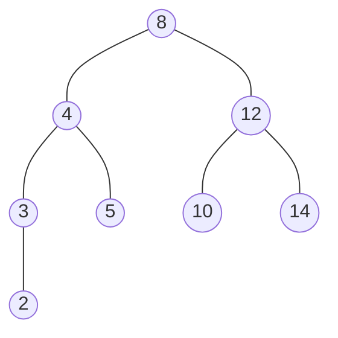
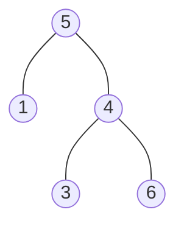

## Breadth-first traversal



以上圖為例，廣度優先的遍歷順序為：`[8, 4, 12, 3, 5, 10, 14, 2]{:js}`

實作上用一個 queue 紀錄待訪問的節點，確保先進入的節點先被處理，從而實現逐層遍歷

```js
function breadthFirstTraverse(rootNode) {
  const queue = [rootNode];
  const result = [];
  
  while (queue.length > 0) {
    const current = queue.shift();
    result.push(current.value);
    
    if (current.left) queue.push(current.left);
    if (current.right) queue.push(current.right);
  }
  
  return result;
}

const rootNode = {
  value: 8,
  left: {
    value: 4,
    left: {
      value: 3,
      left: { value: 2, left: null, right: null },
      right: null
    },
    right: { value: 5, left: null, right: null },
  },
  right: {
    value: 12,
    left: { value: 10, left: null, right: null },
    right: { value: 14, left: null, right: null },
  }
};

breadthFirstTraverse(rootNode);
```

recursive approach

```js
function breadthFirstTraverse = (queue, array = []) => {
  if (!queue.length) return array;
  
  const node = queue.shift();
  array.push(node.value);

  if (node.left) queue.push(node.left);
  if (node.right) queue.push(node.right);
  
  return breadthFirstTraverse(queue, array);
};

breadthFirstTraverse([rootNode], []);
// [8, 4, 12, 3, 5, 10, 14, 2]
```

## Depth-first traversals


深度優先遍歷，有三種不同的遍歷順序，分別為：

- **前序遍歷順序：根節點 → 左子樹 → 右子樹**，即為：`[8, 4, 3, 2, 5, 12, 10, 14]{:js}`
- **中序遍歷順序：左子樹 → 根節點 → 右子樹**，即為：`[2, 3, 4, 5, 8, 10, 12, 14]{:js}`
- **後續遍歷順序：左子樹 → 右子樹 → 根節點**，即為：`[2, 3, 5, 4, 10, 14, 12, 8]{:js}`

前序遍歷的應用：

- 目錄結構遍歷
- 複製樹 (順序較直觀，建立子節點時確保父節點已存在)

中序遍歷的應用：

- 適合有順序的輸出結果，例如：二元搜尋樹
- 驗證是否為二元搜尋樹 (排序必須為由小到大)

後續遍歷的應用：

- 需要先處理子節點，再處理父節點的操作

### Pre-order traversal

```ts
const preorderTraverse = (node, array) => {
  if (!node) return array;

  array.push(node.value);
  array = preorderTraverse(node.left, array);
  array = preorderTraverse(node.right, array);

  return array;
};

const rootNode = {
  value: 8,
  left: {
    value: 4,
    left: {
      value: 3,
      left: { value: 2, left: null, right: null },
      right: null
    },
    right: { value: 5, left: null, right: null },
  },
  right: {
    value: 12,
    left: { value: 10, left: null, right: null },
    right: { value: 14, left: null, right: null },
  }
};

preorderTraverse(rootNode, []);
// [8, 4, 3, 2, 5, 12, 10, 14]
```

### In-order traversal

```ts
const inorderTraverse = (node, array) => {
  if (!node) return array;

  array = inorderTraverse(node.left, array);
  array.push(node.value);
  array = inorderTraverse(node.right, array);

  return array;
};

const rootNode = {
  value: 8,
  left: {
    value: 4,
    left: {
      value: 3,
      left: { value: 2, left: null, right: null },
      right: null
    },
    right: { value: 5, left: null, right: null },
  },
  right: {
    value: 12,
    left: { value: 10, left: null, right: null },
    right: { value: 14, left: null, right: null },
  }
};

inorderTraverse(rootNode, []);
// [2, 3, 4, 5, 8, 10, 12, 14]
```

### Post-order traversal

```ts
const postorderTraverse = (node, array) => {
  if (!node) return array;

  array = postorderTraverse(node.left, array);
  array = postorderTraverse(node.right, array);
  array.push(node.value);

  return array;
};

const rootNode = {
  value: 8,
  left: {
    value: 4,
    left: {
      value: 3,
      left: { value: 2, left: null, right: null },
      right: null
    },
    right: { value: 5, left: null, right: null },
  },
  right: {
    value: 12,
    left: { value: 10, left: null, right: null },
    right: { value: 14, left: null, right: null },
  }
};

postorderTraverse(rootNode, []);
// [2, 3, 5, 4, 10, 14, 12, 8]
```

## Validate binary search tree



透過 inorder traversal 把 `node.value` 依序存入一個陣列中，如果此陣列的排序是由小到大，即為 binary search tree

```js
const isValidBST = function(root) {
  const list = inorderTraverse(root);
  
  for (let i = 1; i <= list.length; i += 1) {
    const prev = list[i - 1];
    const current = list[i];
    
    if (prev >= current) {
      return false;
    }
  }
  
  return true;
};

function inorderTraverse(node, list = []) {
  if (!node) return list;
  
  list = inorderTraverse(node.left, list);
  list.push(node.value);
  list = inorderTraverse(node.right, list);
  
  return list;
}
```

另一種做法是以廣度優先的方式，依序檢查是否滿足 binary search tree。

`min`, `max` 目的都是記錄當下節點的值，所有左子樹節點必須小於 `max`，所有右子樹的節點大於 `min`

```js
var isValidBST = function(root) {
  
  function recurse(node, min, max) {
    if (!node) return true;
    if (node.value >= max) return false;
    if (node.value <= min) return false;
    
    return recurse(node.left, min, node.value) 
      && recurse(node.right, node.value, max);
  }
  
  return recurse(root, -Infinity, Infinity);
};
```

## Reference

- [Complete Intro to Computer Science - Breadth-First Tree Traversals](https://btholt.github.io/complete-intro-to-computer-science/breadth-first-tree-traversals)
- [Complete Intro to Computer Science - Depth-First Tree Traversals](https://btholt.github.io/complete-intro-to-computer-science/depth-first-tree-traversals)
