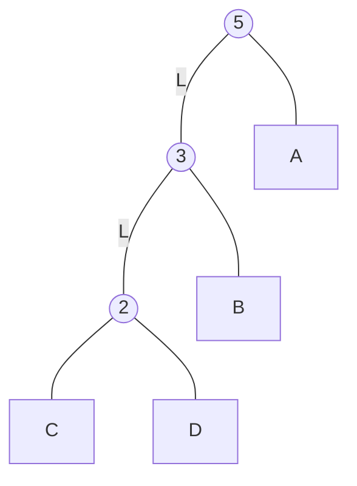
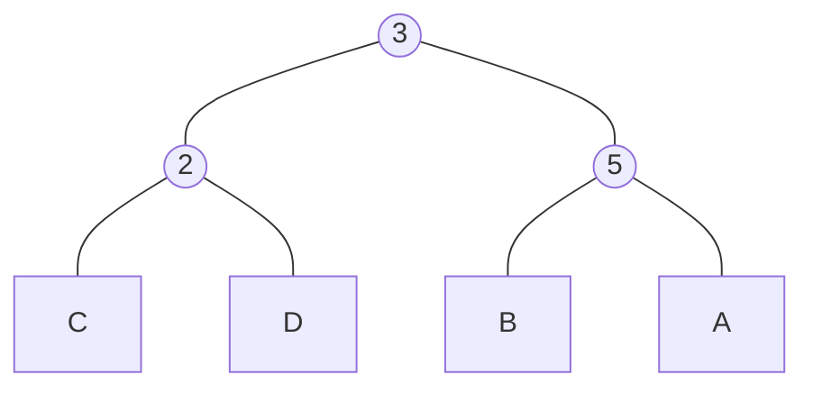
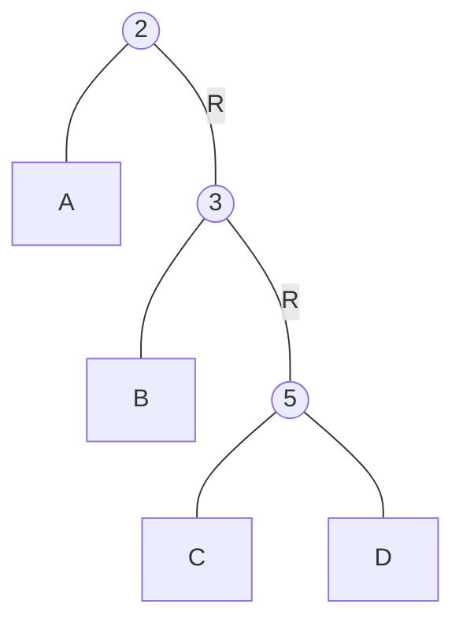
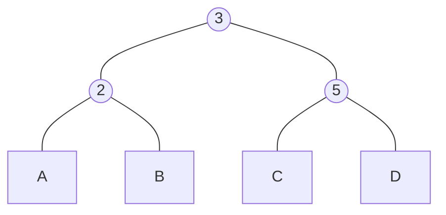
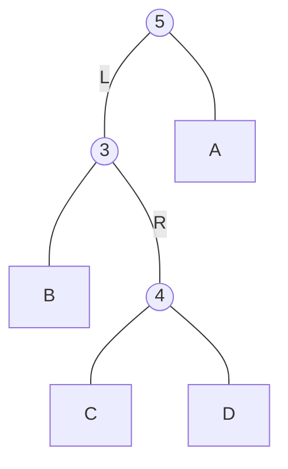
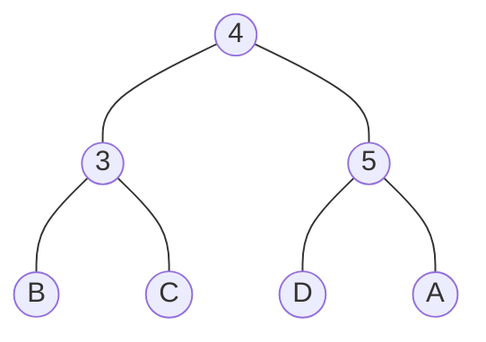
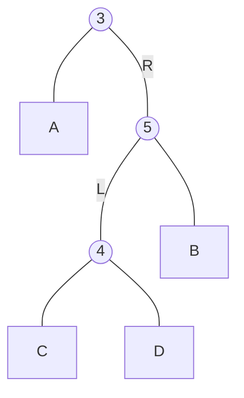
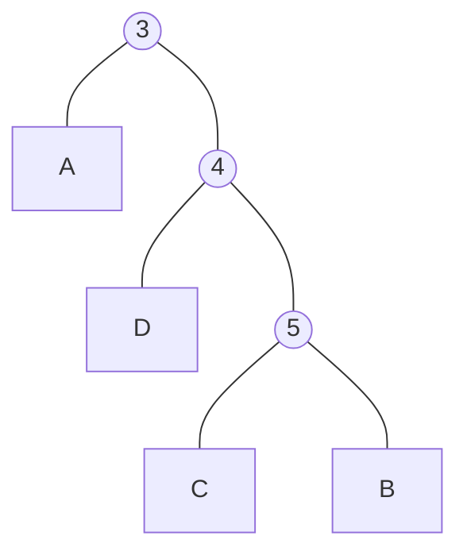
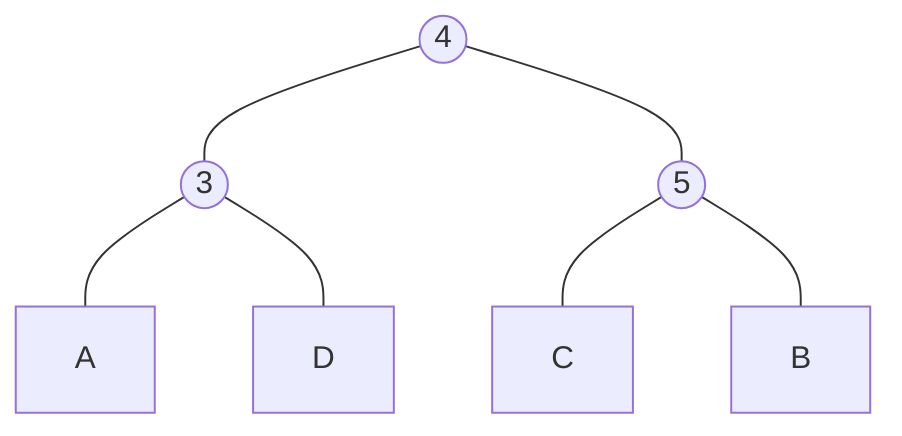

avl tree 中，每個左、右子樹高度相減結果只能是 `-1`、`0`、`1`，若不在此範圍內則表示需要進行高度得重新平衡，平衡的操作分別為以下四種

## Right Rotation

以下圖為例，在節點 `5` 發現左子樹 **LL 型** 失衡



對節點 `5` 做右旋，將左側子節點 `3` 設為基準點，以順時鐘方向旋轉，將節點 `3` 右邊的子節點 `B`，移至 `5` 的左邊子節點，(因為節點 `B` 位於節點 `5` 的左側，在 binary search tree 的規則下，其值必定會小於節點 `5`)，結果如下圖所示



程式實作上，會以改變節點的值 (value) 及左、右子節點的參照 (reference) 達成。

```js
class Node {
  constructor(value) {
    this.value = value;
    this.left = null;
    this.right = null;
  }
  
  rotateLL() {
    const valueBefore = this.value;
    const rightBefore = this.right;

    this.value = this.left.value;  
    this.right = this.left;
    this.left = this.left.left;
    
    this.right.left = this.right.right;
    this.right.right = rightBefore;
    this.right.value = valueBefore;
  }
}
```

## Left Rotation

節點 `2` 的右子樹 **RR 型** 失衡



左旋概念上與右旋相似，旋轉後注意大小值擺放的左右位置



```js
class Node {
  constructor(value) {
    this.value = value;
    this.left = null;
    this.right = null;
  }
  
  rotateRR() {
    const valueBefore = this.value;
    const leftBefore = this.left;
    
    this.value = this.right.value;
    this.left = this.right;
    this.right = this.right.right;
    
    this.left.right = this.left.left;
    this.left.value = valueBefore;
    this.left.right = leftBefore;
  }
}
```

## Left Right Rotation

節點 `5` 上 **LR 失衡**



在左子節點 `4` 左旋一次後，變成 **LL 型**失衡


再對節點 `5` 進行右旋



## Right Left Rotation

**RL** 失衡



先在右子節點 `5` 做一次右旋



再對節點 `3` 做一次左旋



## Reference

[維基百科 - AVL 樹](https://zh.wikipedia.org/wiki/AVL%E6%A0%91)

[Complete Intro to Computer Science - Avl Tree](https://btholt.github.io/complete-intro-to-computer-science/avl-tree)

[CH8. AVL Trees](https://hackmd.io/@Zero871015/rJksqh83X?type=view)
