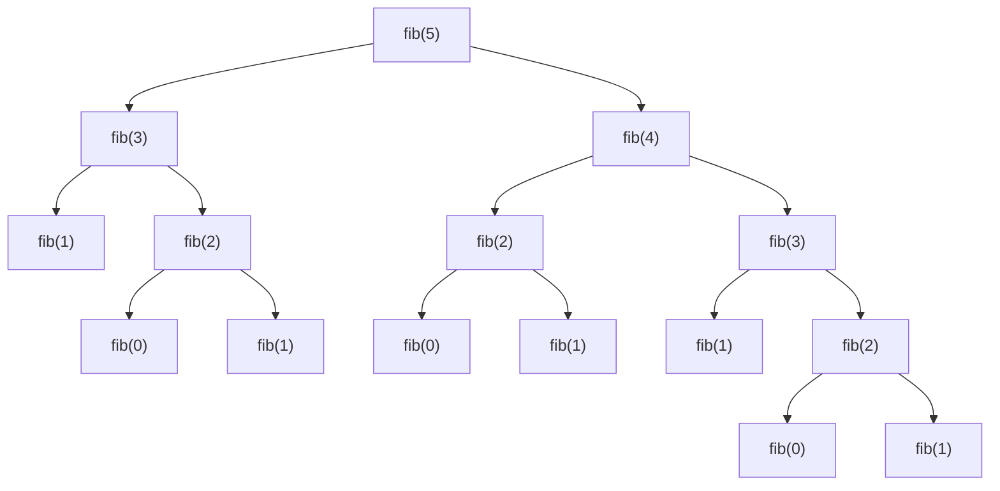

Big O Notation

- 不受環境因素，例如使用的程式語言、硬體規格 ... 等，客觀描述演算法與輸入資料量之間的變化趨勢
- 關注輸入資料量變大後的成長，故會忽略所有係數及常數，並只取最高次方
  - ~~`O(2n + 1)`~~ ==> `O(n)`
  - ~~`O(n² + 2n +3)`~~ ==> `O(n²)`

下方列出幾種常見的時間複雜度，從快到慢依序為

1. `O(1)` (constant)
1. `O(log n)` (logarithmic)
1. `O(n)` (linear)
1. `O(n log n)` (n log n)
1. `O(n²)` (quadratic)
1. `O(2ⁿ)` (exponential)
1. `O(n!)` (factorial)

## O(n) - Linear

透過 for loop 計算費氏數列，時間複雜度為 `O(n)`

```js
//  [0, 1, 1, 2, 3, 5, 8, 13, 21, 34, ...]
function fib(n) {
  const arr = [0, 1];
  for (let i = 2; i <= n; i++) {
    arr[i] = arr[i - 1] + arr[i - 2];
  }
  return arr[n];
}
```

下方為遞迴檢查是否為回文（順讀和倒讀都一樣的詞) 的範例程式碼

當字串長度為奇數時，`palindrome` 會被遞迴執行 `n/2 + 1` 次，長度為偶數時，遞迴執行 `n/2` 次

因為 Big O 忽略係數、常數的關係，時間複雜度仍用 `O(n)` 作為表示

```js
// if there are less than two characters in the string, return true.
// compare first and last characters and recur for remaining substring.

function palindrome(str) {
  if (str.length < 2) {
    return true;
  } 

  const firstChar = str.charAt(0);
  const lastChar = str.charAt(str.length - 1);
  
  if (firstChar === lastChar) {
    return palindrome(str.substring(1, str.length - 1));
  }
  
  return false;
}
```

## O(n²) - Quadratic

簡單來說就是迴圈中再重複一次相同次數的迴圈，下方程式碼以輸出階梯圖形為例

```js
// steps(3)
// '#  '
// '## '
// '###'
function steps(n) {
  for (let row = 0; row < n; row++) {
    let stair = '';
    for (let column = 0; column < n; column++) {
      stair += column <= row ? '#' : ' ';
    }
    console.log(stair);
  }
}
```

## O(2ⁿ) - Exponential

下方程式碼使用遞迴函式來計算費氏數列

當 `fib(n)` 且 `n > 1` 時，除了預先定義好的 `fib(0)`、`fib(1)` 以外，皆需要逐層調用 `fib(n - 1) + fib(n - 2)` 來計算 (如下方圖示)，其時間複雜度約為 `O(2ⁿ)`

```js
function fib(n) {
  if (n < 2) {
    return n;
  }
  
  return fib(n - 1) + fib (n - 2);
}
```



- 補充 - 利用 memoization 優化 recursion fibonacci 執行效率
  - 透過 closure 保存 execution context 的 cache reference
  - cache 以 key-value pairs 形式，儲存 `fn` 調用過的 input, ouput

```js
function memoize(fn) {
  const cache = {};
  return function(...args) {
    if (cache[args]) {
      return cache[args];
    }
    
    const result = fn.apply(this, args);
    cache[args] = result;
    return result;
  }
}

function fib(n) {
  if (n < 2) {
    return n;
  }
  ｀
  return fib(n - 1) + fib (n - 2);
}

fib = memoize(fib);
```

## O(log n) - Logarithm

對數 logarithm 

`3⁴` = `3 * 3 * 3 * 3` = `81`，可以寫作 `4 = log₃ 81`，即 81 以 3 為底的對數是 4

`O(log n)` 不論對數的底數為何，時間複雜度與資料量增長的關係是一樣的

以 binary search 為例，我們不需要在已經排序好的集合中，將元素一個一個取出做判斷。利用中間元素可以將搜索範圍二分為前半、後半，每次將目標元素與中間元素比較後，決定下次的搜尋範圍，直到找到相同元素或只剩至一個元素為止，若只剩一個元素代表該目標不存在。

以下方範例程式碼為例

在一個長度為 `8` 的陣列，使用 binary search，即為 `3 = log₂ 8`，表示在最差的情況下，需要三次步驟來得知搜尋結果

```js
const people = [
  { id: 1, name: 'Sam' },
  { id: 3, name: 'Sarah' },
  { id: 5, name: 'John' },
  { id: 6, name: 'Burke' },
  { id: 10, name: 'Simona' },
  { id: 12, name: 'Asim' },
  { id: 13, name: 'Niki' },
  { id: 15, name: 'Aysegul' },
];

function binarySearch(array, id) {
  let min = 0;
  let max = array.length - 1;
  let element;
  
  while(min <= max) {
    const index = Math.floor((min + max) / 2);
    element = array[index];
    
    if (element.id < id) {
      min = index + 1;
    } else if (element.id > id) {
      max = index - 1;
    } else {
      return element;
    }
  }
  
  return undefined;
}

binarySearch(people, 15);
```

## Reference

[初學者學演算法｜談什麼是演算法和時間複雜度](https://medium.com/appworks-school/%E5%88%9D%E5%AD%B8%E8%80%85%E5%AD%B8%E6%BC%94%E7%AE%97%E6%B3%95-%E8%AB%87%E4%BB%80%E9%BA%BC%E6%98%AF%E6%BC%94%E7%AE%97%E6%B3%95%E5%92%8C%E6%99%82%E9%96%93%E8%A4%87%E9%9B%9C%E5%BA%A6-b1f6908e4b80)

[初學者學演算法｜從時間複雜度認識常見演算法](https://medium.com/appworks-school/%E5%88%9D%E5%AD%B8%E8%80%85%E5%AD%B8%E6%BC%94%E7%AE%97%E6%B3%95-%E5%BE%9E%E6%99%82%E9%96%93%E8%A4%87%E9%9B%9C%E5%BA%A6%E8%AA%8D%E8%AD%98%E5%B8%B8%E8%A6%8B%E6%BC%94%E7%AE%97%E6%B3%95-%E4%B8%80-b46fece65ba5)

[維基百科 - 時間複雜度](https://zh.wikipedia.org/wiki/%E6%97%B6%E9%97%B4%E5%A4%8D%E6%9D%82%E5%BA%A6#%E5%AF%B9%E6%95%B0%E6%97%B6%E9%97%B4)

[維基百科 - 對數](https://zh.wikipedia.org/wiki/%E5%AF%B9%E6%95%B0)

[Complete Intro to Computer Science - Binary Search](https://btholt.github.io/complete-intro-to-computer-science/binary-search)
