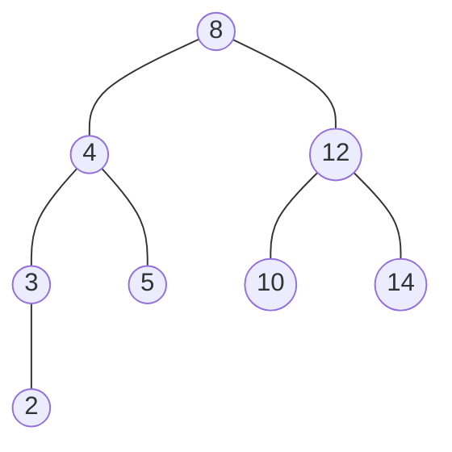
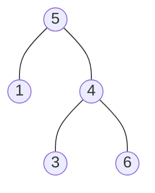

- [Applications of Breadth First Traversal](https://www.geeksforgeeks.org/applications-of-breadth-first-traversal/)
- [Applications of Depth First Search](https://www.geeksforgeeks.org/applications-of-depth-first-search/)
  
## Breadth-First Traversal



- level order: `[8, 4, 12, 3, 5, 10, 14, 2]`

```js
function breadthFirstTraverse(rootNode) {
  const queue = [rootNode];
  const result = [];
  
  while (queue.length > 0) {
    const current = queue.shift();
    result.push(current.value);
    
    if (current.left) queue.push(current.left);
    if (current.right) queue.push(current.right);
  }
  
  return result;
}

const rootNode = {
  value: 8,
  left: {
    value: 4,
    left: {
      value: 3,
      left: { value: 2, left: null, right: null },
      right: null
    },
    right: { value: 5, left: null, right: null },
  },
  right: {
    value: 12,
    left: { value: 10, left: null, right: null },
    right: { value: 14, left: null, right: null },
  }
};

breadthFirstTraverse(rootNode);
```

recursive approach

```js
function breadthFirstTraverse = (queue, array = []) => {
  if (!queue.length) return array;
  
  const node = queue.shift();
  array.push(node.value);

  if (node.left) queue.push(node.left);
  if (node.right) queue.push(node.right);
  
  return breadthFirstTraverse(queue, array);
};

breadthFirstTraverse([rootNode], []);
// [8, 4, 12, 3, 5, 10, 14, 2]
```

## Depth-First Traversals


- preorder: `[8, 4, 3, 2, 5, 12, 10, 14]` (根節點 -> 左子樹 -> 右子樹)
- inorder: `[2, 3, 4, 5, 8, 10, 12, 14]` (左子樹 -> 根節點 -> 右子樹)
- postorder: `[2, 3, 5, 4, 10, 14, 12, 8]` (左子樹 -> 右子樹 -> 根節點)

```js
const preorderTraverse = (node, array) => {
  if (!node) return array;

  array.push(node.value);
  array = preorderTraverse(node.left, array);
  array = preorderTraverse(node.right, array);

  return array;
};

const inorderTraverse = (node, array) => {
  if (!node) return array;

  array = inorderTraverse(node.left, array);
  array.push(node.value);
  array = inorderTraverse(node.right, array);

  return array;
};

const postorderTraverse = (node, array) => {
  if (!node) return array;

  array = postorderTraverse(node.left, array);
  array = postorderTraverse(node.right, array);
  array.push(node.value);

  return array;
};

const rootNode = {
  value: 8,
  left: {
    value: 4,
    left: {
      value: 3,
      left: { value: 2, left: null, right: null },
      right: null
    },
    right: { value: 5, left: null, right: null },
  },
  right: {
    value: 12,
    left: { value: 10, left: null, right: null },
    right: { value: 14, left: null, right: null },
  }
};

preorderTraverse(rootNode, []);
// [8, 4, 3, 2, 5, 12, 10, 14]
inorderTraverse(rootNode, []);
// [2, 3, 4, 5, 8, 10, 12, 14]
postorderTraverse(rootNode, []);
// [2, 3, 5, 4, 10, 14, 12, 8]
```

## Validate Binary Search Tree



透過 inorder traversal 把 `node.value` 依序存入一個陣列中，如果此陣列的排序是由小到大，即為 binary search tree

```js
const isValidBST = function(root) {
  const list = inorderTraverse(root);
  
  for (let i = 1; i <= list.length; i += 1) {
    const prev = list[i - 1];
    const current = list[i];
    
    if (prev >= current) {
      return false;
    }
  }
  
  return true;
};

function inorderTraverse(node, list = []) {
  if (!node) return list;
  
  list = inorderTraverse(node.left, list);
  list.push(node.value);
  list = inorderTraverse(node.right, list);
  
  return list;
}
```

另一種做法是以廣度優先的方式，依序檢查是否滿足 binary search tree。

`min`, `max` 目的都是記錄當下節點的值，所有左子樹節點必須小於 `max`，所有右子樹的節點大於 `min`

```js
var isValidBST = function(root) {
  
  function recurse(node, min, max) {
    if (!node) return true;
    if (node.value >= max) return false;
    if (node.value <= min) return false;
    
    return recurse(node.left, min, node.value) 
      && recurse(node.right, node.value, max);
  }
  
  return recurse(root, -Infinity, Infinity);
};

```


## Reference

[Complete Intro to Computer Science - Depth-First Tree Traversals](https://btholt.github.io/complete-intro-to-computer-science/depth-first-tree-traversals)

[Complete Intro to Computer Science - Breadth-First Tree Traversals](https://btholt.github.io/complete-intro-to-computer-science/breadth-first-tree-traversals)
