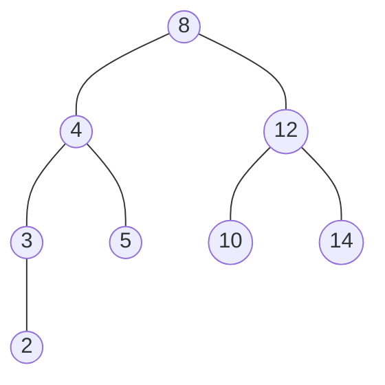

- depth-first
  - preorder
  - inorder
  - postorder
- breadth-first
  - levelorder

## Depth-First Traversals



- preorder (前序遍歷)
  - 根節點 --> 左子樹 --> 右子樹
  - 8 --> 4 --> 3 --> 2 --> 5 --> 12 --> 10 --> 14
- inorder (中序遍歷)
  - 左子樹 --> 根節點 --> 右子樹
  - 2 --> 3 --> 4 --> 5 --> 8 --> 10 --> 12 --> 14
- postorder (後序遍歷)
  - 左子樹 --> 右子樹 --> 根節點
  - 2 --> 3--> 5 --> 4 --> 10 --> 14 --> 12 --> 8

```js
const preorderTraverse = (node, array) => {
  if (!node) return array;

  array.push(node.value);
  array = preorderTraverse(node.left, array);
  array = preorderTraverse(node.right, array);

  return array;
};

const inorderTraverse = (node, array) => {
  if (!node) return array;

  array = inorderTraverse(node.left, array);
  array.push(node.value);
  array = inorderTraverse(node.right, array);

  return array;
};

const postorderTraverse = (node, array) => {
  if (!node) return array;

  array = postorderTraverse(node.left, array);
  array = postorderTraverse(node.right, array);
  array.push(node.value);

  return array;
};

const rootNode = {
  value: 8,
  left: {
    value: 4,
    left: {
      value: 3,
      left: { value: 2, left: null, right: null },
      right: null
    },
    right: { value: 5, left: null, right: null },
  },
  right: {
    value: 12,
    left: { value: 10, left: null, right: null },
    right: { value: 14, left: null, right: null },
  }
};

preorderTraverse(rootNode, []);
// [8, 4, 3, 2, 5, 12, 10, 14]
inorderTraverse(rootNode, []);
// [2, 3, 4, 5, 8, 10, 12, 14]
postorderTraverse(rootNode, []);
// [2, 3, 5, 4, 10, 14, 12, 8]
```

## Breadth-First Traversal


- levelorder
  - 依照樹的階層做遍歷
  - 8 --> 4 --> 12 --> 3 --> 5 --> 10 --> 14 --> 2

```js
const breadthFirstTraverse = (queue, array) => {
  if (!queue.length) return array;
  
  const node = queue.shift();
  array.push(node.value);

  if (node.left) queue.push(node.left);
  if (node.right) queue.push(node.right);
  
  return breadthFirstTraverse(queue, array);
};

const rootNode = {
  value: 8,
  left: {
    value: 4,
    left: {
      value: 3,
      left: { value: 2, left: null, right: null },
      right: null
    },
    right: { value: 5, left: null, right: null },
  },
  right: {
    value: 12,
    left: { value: 10, left: null, right: null },
    right: { value: 14, left: null, right: null },
  }
};

breadthFirstTraverse([rootNode], []);
// [8, 4, 12, 3, 5, 10, 14, 2]
```

## Reference

[Complete Intro to Computer Science - Depth-First Tree Traversals](https://btholt.github.io/complete-intro-to-computer-science/depth-first-tree-traversals)

[Complete Intro to Computer Science - Breadth-First Tree Traversals](https://btholt.github.io/complete-intro-to-computer-science/breadth-first-tree-traversals)
