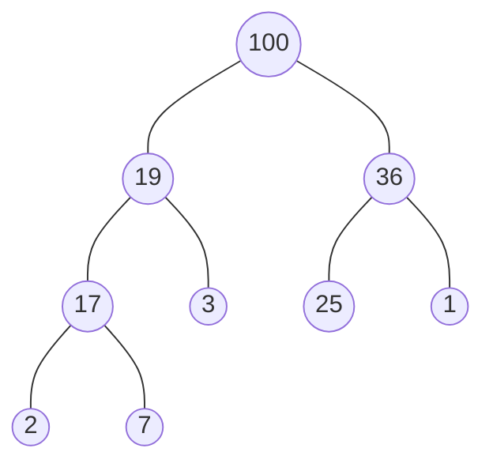

## Heap

- 由上至下，由左至右依順序加入節點
- 完全二元樹 (complete binary tree)，若節點非葉節點，則一定擁有兩個子節點
- 所有父節點大於子節點稱為最大堆積 (max-heap)，最小堆積 (min-heap) 反之

max-heap



以陣列表示 (由上至下，由左至右排列)，若 n 為陣列中任意的 index

- left child index equals `2n + 1`
- right child index equals `2n + 2`

```js
const maxHeap = [100, 19, 36, 17, 3, 25, 1, 2, 7];
```

## Heapify

heapify 是將陣列調整為 heap 的操作，以 max-heap 來例

- 子節點小於父節點
- 根節點為最大元素

下方範例先取出父節點、左子節點、右子節點三者做比較，當子節點大於父節點則與之對調，因為不確保每次對調後，子樹是否符合「子節點小於父節點」的條件，所以透過遞迴方式一層一層向下檢查

```js
const maxHeapify = (array, index, heapSize) => {
  const leftIndex = 2 * index + 1;
  const rightIndex = 2 * index + 2;
  let largestValueIndex = index;
  
  if (heapSize > leftIndex && array[largestValueIndex] < array[leftIndex]) {
    largestValueIndex = leftIndex;
  }
  
  if (heapSize > rightIndex && array[largestValueIndex] < array[rightIndex]) {
    largestValueIndex = rightIndex;
  }
  
  if (index !== largestValueIndex) {
    const largest = array[largestValueIndex];
    array[largestValueIndex] = array[index];
    array[index] = largest;
    maxHeapify(array, largestValueIndex, heapSize);
  }
}

// create max-heap
const nums = [5, 3, 2, 10, 1, 9, 8, 6, 4, 7];

for (let i = Math.floor(nums.length / 2) - 1; i >= 0; i--) {
  maxHeapify(nums, i, nums.length);
}
// [10, 7, 9, 6, 5, 2, 8, 3, 4, 1]
```

## Heap Sort

1. 將序列轉換為 max-heap 結構
1. 將最大值 (root) 與最後一筆未排序元素對調，即為排序一筆元素
1. 忽略已排序的元素，重複以上步驟

```js
const maxHeapify = (array, index, heapSize) => {
  const leftIndex = 2 * index + 1;
  const rightIndex = 2 * index + 2;
  let largestValueIndex = index;
  
  if (heapSize > leftIndex && array[largestValueIndex] < array[leftIndex]) {
    largestValueIndex = leftIndex;
  }
  
  if (heapSize > rightIndex && array[largestValueIndex] < array[rightIndex]) {
    largestValueIndex = rightIndex;
  }
  
  if (index !== largestValueIndex) {
    const largest = array[largestValueIndex];
    array[largestValueIndex] = array[index];
    array[index] = largest;
    maxHeapify(array, largestValueIndex, heapSize);
  }
}

function heapSort(array) {
  for (let i = Math.floor(array.length / 2) - 1; i >= 0; i--) {
    maxHeapify(array, i, array.length);
  }
  
  for (let i = array.length - 1; i > 0; i--) {
    const lesser = array[i];
    array[i] = array[0];
    array[0] = lesser;
    maxHeapify(array, 0, i);
  }
  
  return array;
}

heapSort([5, 3, 2, 10, 1, 9, 8, 6, 4, 7]);
```

## Reference

[Build-Max-Heap: Why Start i at floor(A.length/2) rather than A.length?](https://cs.stackexchange.com/questions/71786/build-max-heap-why-start-i-at-floora-length-2-rather-than-a-length)

[堆積排序 Heapsort](https://rust-algo.club/sorting/heapsort/)

[Complete Intro to Computer Science - Heap Sort](https://btholt.github.io/complete-intro-to-computer-science/heap-sort)
