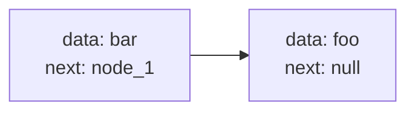
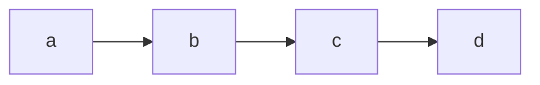

- node 為 linked list 中的節點，每個 node 會紀錄對應的資料，以及指向下一個 node 的指標
- linked list 紀錄起始的 node，透過 node 的指標，將記憶體中不連續的空間給串連起來
  - 在 linked list 中，當 node 下一個指標為 `null` 時，該 node 即為 tail node
  - 新增(刪除)起始節點時間複雜度為： `O(1)`
  - index 相關操作，例如搜尋特定位置對應的 node ，或是在最後一個節點新增 node，時間複雜度為 `O(n)`
  - 實作指定 index 的插入 / 刪除，記得要考慮
    - index 對應的 node 是否為 head node / tail node
    - index 是否超出 linked list size
    - 是否存在 cycle

```js
class Node {
  constructor(data, next = null) {
    this.data = data;
    this.next = next;
  }
}

class LinkedList {
  constructor(head) {
    this.head = head;
  }
  
  addToHead(data) {
    this.head = new Node(data, this.head);
  }
  
  addToTail(data) {
    if (!this.head) {
      this.head = new Node(data, null);
      return;
    }

    let node = this.head;

    while(node.next !== null) {
      node = node.next;
    }

    node.next = new Node(data, node);
  }
}

const node_1 = new Node('foo');
const node_2 = new Node('bar', node_1);
const list = new LinkedList(node_1);
```



## The Middle Point of the Linked List

1. 藉由 `slow`、`fast` 兩個指標
1. `slow` 每次前進一個節點，`fast` 每次前進兩個節點
1. 當 `fast` 為最後節點，或無法前進兩個節點時，`slow` 即為中間的 node 

```js
function midpoint(list) {
  let slow = list.head;
  let fast = list.head;
  
  while (fast.next && fast.next.next) {
    slow = slow.next;
    fast = fast.next.next;
  }
  
  return slow;
}
```

## Check is a Circular Linked List

1. 藉由 `slow`、`fast` 兩個指標
1. `slow` 每次前進一個節點，`fast` 每次前進兩個節點
1. 若 linked list 存在 cycle，`fast` 最終會追上 `slow`

```js
function circular(list) {
  if (!list.head) {
    return false;
  }

  let slow = list.head;
  let fast = list.head;
  let result = false;
  
  while (fast.next && fast.next.next) {
    slow = slow.next;
    fast = fast.next.next;

    if (slow === fast) {
      result = true;
      break;
    }
  }
  
  return result;
}
```

## Get n’th node from the end of a Linked List



```
Assume that n will always be less than the length of the list.
fromLast(list, 0).data d
fromLast(list, 2).data b
```

1. 先將 `fast` 位移 n 個節點
1. `fast` 為 tail node 時，`slow` 即為從 linked list 結尾開始，從 0 算起第 n 個 node

```js
function fromLast(list, n) {
  let slow = list.head;
  let fast = list.head;
  
  while (n > 0) {
    fast = fast.next;
    n--;
  }
  
  while (fast.next) {
    slow = slow.next;
    fast = fast.next;
  }
  
  return slow;
}
```

## Reverse a Linked List

這邊透過三個變數交換的方式，來改變 `node.next` 指向

- current: 目前的節點
- previous: 前一個節點
- temporary: 實作交換用的暫存節點

大致流程如下

```
null--->1--->2--->3--->4--->5--->null
|       |
|       current
previous

// temporary = current
// current = current.next

null--->1--->2--->3--->4--->5--->null
|       |    |
|       |    current
|       temporary
previous

// temporary.next = previous

null<---1--->2--->3--->4--->5--->null
|       |    |
|       |    current    
|       temporary       
previous 

// previous = temporary

null<---1--->2--->3--->4--->5--->null
        |    |
        |    current
        temporary
        previous
```

程式碼實作如下

```js
function reverseList(head) {
  if (!head || !head.next) {
    return head;
  }
  
  let current = head;
  let previous = null;
  let temporary;
  
  while (current !== null) {
    temporary = current;
    current = current.next;
    temporary.next = previous;
    previous = temporary;
  }
  
  return previous;
};
```

## Reference

[The Coding Interview Bootcamp: Algorithms + Data Structures](https://www.udemy.com/course/coding-interview-bootcamp-algorithms-and-data-structure/)
