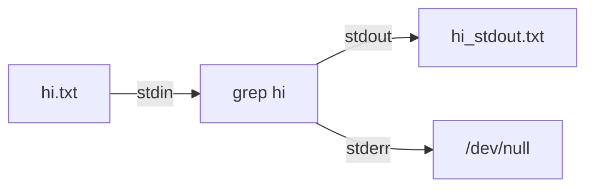

- streams
- redirection
- pipes

## The Standard Streams

stdout 與 stderr 的預設輸出皆為螢幕 (terminal screen)

- stdin，執行指令所需要的資料，代碼為 `0`
- stdout，執行指令後回傳的正確訊息，代碼為 `1`
- stderr，執行指令後回傳的錯誤訊息，代碼為 `2` 

## Redirection

### stdout / stderr

將 `stdout` 與 `stderr` 輸出至其他檔案或裝置上

replacing and appending

```bash
# redirect the output into a file
# it will create a new file if the file is not exist
# it will replace the file content
echo "hi there" 1> hi.txt
# it will add new stuff to the end
echo "foo bar" 1>> hi.txt
```

separating stderr and stdout streams to different files

```bash
ls non_exist.txt 1> stdout.txt 2> stderr.txt
```

redirecting to the same file

```bash
ls non_exist &> output.txt
```

just run the program and ignore any outputs

```bash
ls -lsah 1> /dev/null
```

### stdin

將原本需要由鍵盤輸入的資料，改由檔案內容來取代

```bash
cat < hi.txt
```

using stdin and stdout



```bash
grep "hi" < hi.txt 1> hi_stdout.txt 2> /dev/null
```

`<<` 表示結束此程序的關鍵字（由鍵盤輸入）

```bash
cat < hi.txt << "ok"
```

## Pipes

`|` take the program stdout as input and put it into the next program.

for example removing all merged branches with `egrep`, `xargs` and `pipe`

```bash
git branch --merged | egrep -v "(^\*|master|main|dev)" | xargs git branch -d
```

- `egrep` equals `grep -E` and `-v` means inverse match
- `xrgs` reads space, tab, newline and end-of-file delimited strings from the standard input and executes utility with the strings as arguments.

## Reference

[Complete Intro to Linux and the CLI - Streams and Pipes](https://btholt.github.io/complete-intro-to-linux-and-the-cli/streams-and-pipes)

[How can I delete all Git branches which have been merged?](https://stackoverflow.com/questions/6127328/how-can-i-delete-all-git-branches-which-have-been-merged)

[Linux I/O 輸入與輸出重新導向，基礎概念教學](https://blog.gtwang.org/linux/linux-io-input-output-redirection-operators/)

[Linux 系統 xargs 指令範例與教學](https://blog.gtwang.org/linux/xargs-command-examples-in-linux-unix/)
