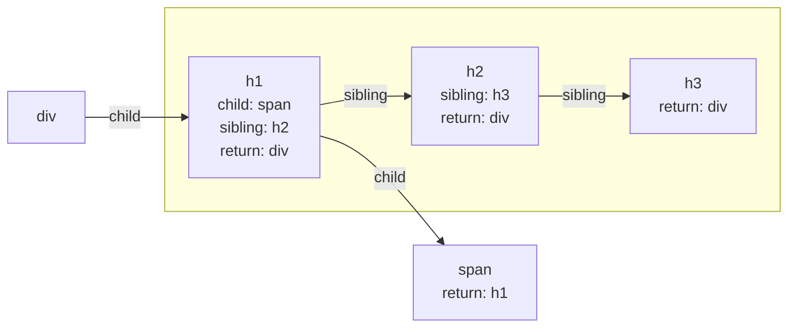

react fiber 是為了實現 incremental rendering，在 react 16 對 react reconciler 的重新實作。

將更新畫面的工作，分割成更小的單位，並將其區分優先順序，分散到多個幀數上

- 分割工作，避免複雜的任務佔用 main thread (the main thread is the same as the ui thread)
- 不同類型的更新，都有不同的優先順序，下方引用 [React Fiber Architecture](https://github.com/acdlite/react-fiber-architecture#scheduling) 提到的 key points

> - In a UI, it's not necessary for every update to be applied immediately; in fact, doing so can be wasteful, causing frames to drop and degrading the user experience.
> - Different types of updates have different priorities — an animation update needs to complete more quickly than, say, an update from a data store.
> - A push-based approach requires the app (you, the programmer) to decide how to schedule work. A pull-based approach allows the framework (React) to be smart and make those decisions for you.

## What is a Fiber

react component as function of data

```
component = f(data)
```

react 15 的 stack reconciler 以同步遞迴的方式，取得 component tree。當 component 過於複雜，會導致 call stack 太深，佔用 main thread 超過 16ms，導致畫面掉幀 (drop frame)。

`requestAnimationFrame`, `requestIdleCallback` 有助於分幀及優先順序的處理，為了有效使用這些 api，需要把 component tree 拆分成粒度更小的工作單位。

- `requestAnimationFrame`: schedules a high priority function
- `requestIdleCallback`: schedules a low priority function

fiber 為一個工作單位，大部分的 fiber 是在初始渲染透過 react element 建立，在 javascript 中以物件表示，負責記錄組件的資料及工作階段。

react 16 後，component tree 是以 linked list 結構儲存，linked list 可以透過 pointer 紀錄目前的工作節點，所以在更新過程也可以暫停，先把資源讓給優先級更高的工作。

## Fiber Tree

每個 react element 都有對應的 fiber node，每個 fiber node 上只有一個 `child`, `sibling`, `return` 屬性，用來表示其他 fiber node 之間的關係，形成一個 fiber tree。

```jsx
const Component = () => (
  <div>
    <h1>
      <span>Heading 1</span>
    </h1>
    <h2>Heading 2</h2>
    <h3>Heading 3</h3>
  </div>
);
```



fiber tree 會以深度優先方式進行 tree traversal，直到當下的 fiber node 沒有 `child`，才開始處理 fiber node 對應的任務，上面範例的「任務完成順序」為 `span, h1, h2, h3, div`。

## Two Phases of Fiber Reconciler

在第一次渲染得到的 fiber tree 稱為 current tree，後續 state 更新會建立一個 work-in-progress tree，用來反映未來的畫面狀態。

work-in-progress tree 會與 current tree 的 fiber node 做比對，並搜集此次更新，fiber node 需要執行的 side effect 至 effect list，等 work-in-progress tree 完成更新後，會取代目前的 current tree。

- render phase (asynchronous): 分幀方式，處理畫面上看不到的任務 e.g. 更新 fiber tree, effect list
- commit phase (synchronous): 更新可視畫面，執行生命週期、side effects ...

## Reference

[React Fiber Architecture](https://github.com/acdlite/react-fiber-architecture)

[React 開發者一定要知道的底層機制 — React Fiber Reconciler](https://medium.com/starbugs/react-%E9%96%8B%E7%99%BC%E8%80%85%E4%B8%80%E5%AE%9A%E8%A6%81%E7%9F%A5%E9%81%93%E7%9A%84%E5%BA%95%E5%B1%A4%E6%9E%B6%E6%A7%8B-react-fiber-c3ccd3b047a1)

[隱藏在 React 下的機制： Fiber](https://tech-blog.cymetrics.io/posts/mingyou/deep-dive-into-react-fiber/)

[What Is React Fiber? React.js Deep Dive #2](https://www.youtube.com/watch?v=0ympFIwQFJw)
