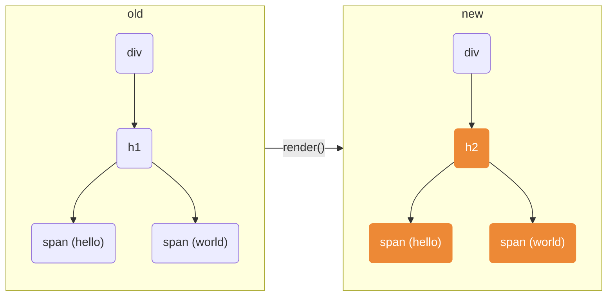
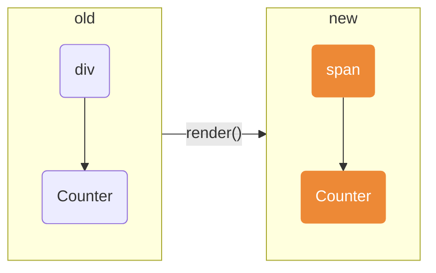
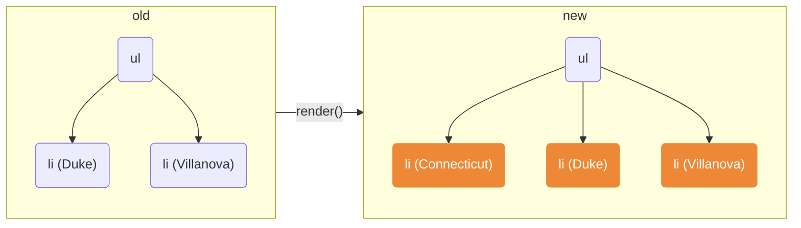

Reconciliation 指的是，React 底層透過 Diffing algorithm，找出用最少操作將舊 tree 轉換成新 tree 的過程。

Diffing algorithm 是基於以下兩個假設，複雜度為 `O(n)` 的演算法

1. 兩個不同類型的 element 會產生出不同的 tree。
1. 通過 `key` prop 來指出哪些子 element 在不同的 render 下能保持不變。

## Elements of the Different Types

dom node example, rebuild the tree inside the div from scratch (tear down the old tree)

```jsx
<div>
  <h1>
    <span>hello</span>
    <span>world</span>
  </h1>
</div>
// render()

<div>
  <h2>
    <span>hello</span>
    <span>world</span>
  </h2>
</div>
```



---

component example, this will destroy the old Counter and remount a new one.

```jsx
<div>
  <Counter />
</div>
// render()

<span>
  <Counter />
</span>
```



## Elements of the Same Types

- **DOM Elements**：保留 DOM 節點，只更新有改變的 attribute，處理完目前節點之後，React 會繼續對 children 進行遞迴處理。
- **Component Elements**：component instance 保持不變，state 能夠被保留在不同次的 render 中，React 會更新該 component instance 的 props，以跟最新的 element 保持一致，並且呼叫該 instance 對應的方法，e.g. `componentDidUpdate()`。 Diff 算法將會遞迴處理舊的結果以及新的結果。

## Keys

在 array 開頭加入一個新元素，在沒有 unique key 的前提下，因為 elements 對應的 position 與目前的 tree 不相同，所以 React 會針對每個 child 進行 mutate。

```jsx
<ul>
  <li>Duke</li>
  <li>Villanova</li>
</ul>
// render()

<ul>
  <li>Connecticut</li>
  <li>Duke</li>
  <li>Villanova</li>
</ul>
```



針對 list rendering 提供 unique key 可以

- 避免 DOM 節點被不必要的重新建立 (可以優化頻繁更新，且大量資料渲染的情境，例如透過 websocket 即時更新的資料，Autocomplete 的選項等...)。
- 避免 child component 中拿到不正確的 state。

## Glossary

[React Elements](https://reactjs.org/docs/glossary.html#elements)

>JSX gets compiled to React.createElement() calls which return plain JavaScript objects called “React elements”.

```jsx
const element = <h1>Hello, world</h1>;
// equals 
// React.createElement('h1', null, 'Hello, world');
```

[React Components](https://reactjs.org/docs/glossary.html#components)

>React components are small, reusable pieces of code that return a React element to be rendered to the page. The simplest version of React component is a plain JavaScript function that returns a React element:

```jsx
const MyComponent = () => (
  <div>My Component</div>
);
```
## Reference

[React - Reconciliation](https://reactjs.org/docs/reconciliation.html)

[How Does React Actually Work? React.js Deep Dive #1](https://www.youtube.com/watch?v=7YhdqIR2Yzo&list=PLxRVWC-K96b0ktvhd16l3xA6gncuGP7gJ&index=1)
