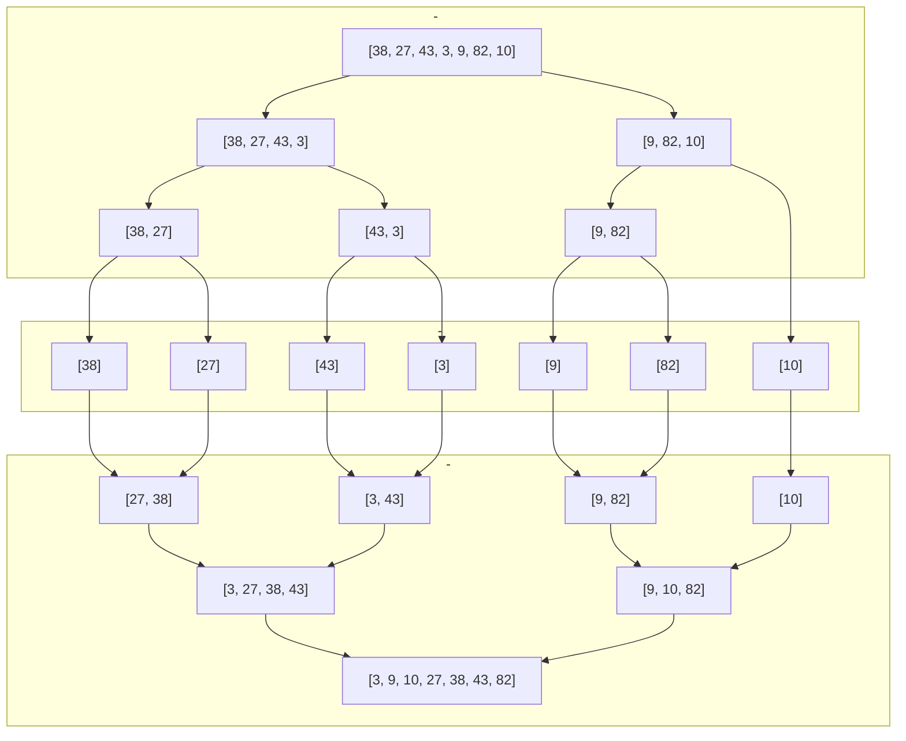
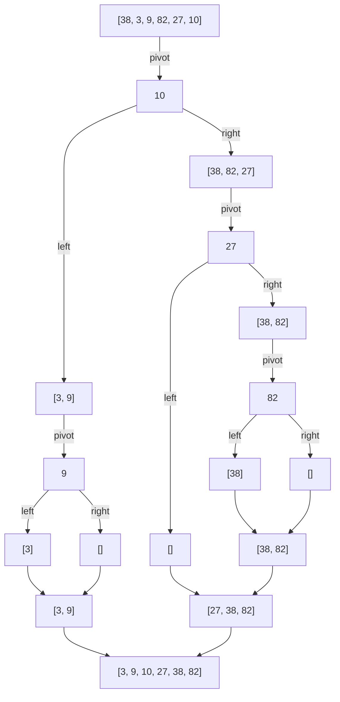

- merge sort
- quick sort

遞迴並非唯一解，不過本質上都是把大問題分解成相似小問題後，重複解決這些小問題得出最後答案，所以適合以遞迴的方式來思考

## Merge Sort

- 將陣列對半切分成兩個小陣列，直到每個小陣列中只剩一個元素
- 按照由小到大的順序，合併切分後的小陣列
- 拆分共 n - 1 次，合併需要 n 次 log n 輪，`(n - 1) + (n log n)` 忽略常數取最高次方，時間複雜度為 `O(n log n)`



```js
function mergeSort(nums) {
  if (nums.length === 1) {
    return nums;
  }

  const middleIndex = Math.floor(nums.length / 2);
  const left = nums.slice(0, middleIndex);
  const right = nums.slice(middleIndex);
  
  return merge(mergeSort(left), mergeSort(right));
};

function merge(left, right) {
  const results = [];
  
  while(left.length && right.length) {
    if (left[0] <= right[0]) {
      results.push(left.shift());
    } else {
      results.push(right.shift());
    }
  }
  
  return results.concat(left, right);
};

mergeSort([38, 27, 43, 3, 9, 82, 10]);
```

## Quick Sort

1. 從陣列中取出一個元素作為基準點，這裡以 `pivot` 代稱
1. 建立兩個陣列，這裡以 `left`、`right` 代稱，比較陣列內剩餘元素，比 `pivot` 小則放至 `left`，反之放至 `right`
1. 將 `left`、`right` 重複 1、2 步驟，直到無法再劃分。

其原理像是 binary search tree 中的 inorder traversal，先從左子樹到根節點再往右子樹，順序是由小到大。

根據判斷基準點 `pivot` 的實作方式，會影響 quick sort 的時間複雜度，如同 binary search tree 不平衡的高度情況，下方範例最差情況為 `O(n²)`，最佳情況為 `O(n log n)`




```js
function quickSort(nums) {
  if (nums.length <= 1) {
    return nums;
  }
  
  const pivot = nums[nums.length - 1];
  const left = [];
  const right = [];

  for (let i = 0; i < nums.length - 1; i++) {
    const num = nums[i];

    if (num < pivot) {
      left.push(num);
    } else {
      right.push(num);
    }
  }
  
  const sortedLeft = quickSort(left);
  const sortedRight = quickSort(right);
  return sortedLeft.concat(pivot, sortedRight);
}

quickSort([38, 3, 9, 82, 27, 10]);
```

## Reference

[維基百科 - 合併排序](https://zh.wikipedia.org/wiki/%E5%BD%92%E5%B9%B6%E6%8E%92%E5%BA%8F)

[初學者學演算法｜排序法進階：合併排序法](https://medium.com/appworks-school/%E5%88%9D%E5%AD%B8%E8%80%85%E5%AD%B8%E6%BC%94%E7%AE%97%E6%B3%95-%E6%8E%92%E5%BA%8F%E6%B3%95%E9%80%B2%E9%9A%8E-%E5%90%88%E4%BD%B5%E6%8E%92%E5%BA%8F%E6%B3%95-6252651c6f7e)

[排序 3: 合併排序 Merge Sort](https://ithelp.ithome.com.tw/articles/10218895)

[Complete Intro to Computer Science - Merge Sort](https://btholt.github.io/complete-intro-to-computer-science/merge-sort)

[Complete Intro to Computer Science - Quick Sort](https://btholt.github.io/complete-intro-to-computer-science/quick-sort)