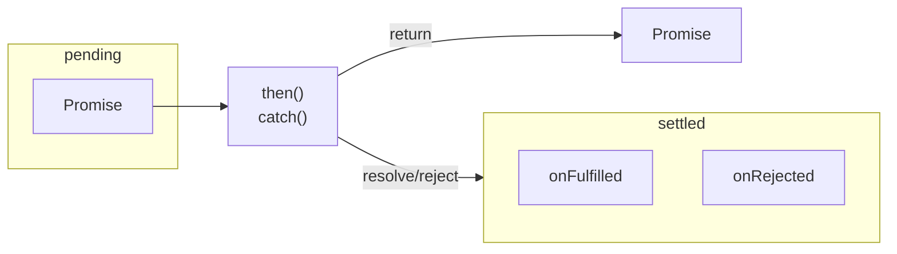

這裡使用 producer-consumer 概念進行實作，調用 `then` 或 `catch` 是委派任務給下一個 promise，當 producer promise 處理完資料及改變狀態後，則對所有 consumer 進行通知，consumer 則根據收到的狀態來調用 callback。

詳細實作如下

```js
// promise states
const states = {
  pending: 0,
  fulfilled: 1,
  rejected: 2,
};

// promise implementation
class DemoPromise {
  constructor(executor) {
    if (typeof executor !== 'function') {
      throw new TypeError('Promise resolver undefined is not a function');
    }
    
    this._state = states.pending;
    this._consumers = [];
    this._value = undefined;
    this._onFulfilled = undefined;
    this._onRejected = undefined;
    
    try {
      executor(this._resolvePromise, this._rejectPromise);
    } catch(error) {
      this._rejectPromise(error);
    }
  }
  
  _resolvePromise = (value) => {
    // 2.3.1
    if (value === this) {
      throw new TypeError('Chaining cycle detected for promise');
    }

    if (this._state === states.pending) {
      this._state = states.fulfilled;
      this._value = value;
      this._broadcast();
    }
  }
  
  _rejectPromise = (reason) => {
    if (this._state === states.pending) {
      this._state = states.rejected;
      this._value = reason;
      this._broadcast();
    }
  }
  
  _broadcast = () => {
    if (this._state === states.pending) {
      return;
    }
    
    const nextTick = getNextTick();
    
    nextTick(() => {
      while (this._consumers.length) {
        const consumer = this._consumers.shift();
        
        const resolver = this._state === states.fulfilled
          ? consumer._resolvePromise
          : consumer._rejectPromise;
        const callback = this._state === states.fulfilled
          ? consumer._onFulfilled
          : consumer._onRejected;

        const hasCallback = typeof callback === 'function';
        if (!hasCallback) {
          resolver(this._value);
          return;
        }

        const nextValue = callback(this._value);
        
        // 2.3.2 - If next value is a promise, adopt its state
        const isThenable = checkIsThenable(nextValue);
        if (isThenable) {
          nextValue.then(consumer._resolvePromise, consumer._rejectPromise);
          return;
        }
        
        resolver(nextValue);
      }
    })
  }
  
  then = (onFulfilled = undefined, onRejected = undefined) => {
    const nextPromise = new DemoPromise(() => {});

    nextPromise._onFulfilled = onFulfilled;
    nextPromise._onRejected = onRejected;
    this._consumers.push(nextPromise);
    this._broadcast();
    
    return nextPromise;
  }
  
  catch = (onRejected) => this.then(undefined, onRejected);
  
  static race(iterable) {
    if (!checkIsIterable(iterable)) {
      throw new TypeError('not a iterable');
    }
    
    const iterableArray = Array.from(iterable);
    return new DemoPromise((resolve, reject) => {
      iterableArray.forEach((element) => {
        if (checkIsThenable(element)) {
          element.then(resolve, reject);
        } else {
          resolve(element);
        }
      });
    });
  }
  
  static all (iterable) {
    if (!checkIsIterable(iterable)) {
      throw new TypeError('not a iterable');
    }
    
    const iterableArray = Array.from(iterable);
    return new DemoPromise((resolve, reject) => {
      let completedCount = 0;
      const result = [];

      iterableArray.forEach((item, index) => {
        if (!checkIsThenable(item)) {
          setResult(index, item);
          return;
        }
        item.then((value) => setResult(index, value), reject);
      });
      
      function setResult(index, value) {
        completedCount += 1;
        result[index] = value;

        if (completedCount === iterableArray.length) {
          resolve(result);
        }
      }
    });
  }
  
  static resolve(value) {
    return new DemoPromise((resolve, reject) => resolve(value));
  }
  
  static reject(reason) {
    return new DemoPromise((resolve, reject) => reject(reason));
  }
}

// helper functions
function getNextTick() {
  if (typeof queueMicrotask === 'function') {
    return queueMicrotask;
  }
  
  if (Promise) {
    return (callback) => Promise.resolve().then(callback);
  }
  
  if (typeof process !== 'undefined'
    && typeof process.nextTick === 'function'
  ) {
    return process.nextTick;
  }
  
  return (callback) => setTimeout(callback, 0);
};

function checkIsIterable(target) {
  return !!target && typeof target[Symbol.iterator] === 'function';
};

function checkIsThenable(target) {
  return !!target
    && !!target.then
    && typeof target.then === 'function';
};
```

補充在 promise a+ 2.3.2 有提到，`onFulfilled` 或 `onRejected` 執行後的回傳值為 promise，將採用該 promise 狀態，例如下方情況。

```js
const promise = Promise.resolve('foo').then(() => {
  return new Promise((resolve) => {
    setTimeout(() => resolve('bar'), 200);
  });
});
```

## Reference

[Promises/A+](https://promisesaplus.com/)

[Basic Javascript promise implementation attempt](https://stackoverflow.com/questions/23772801/basic-javascript-promise-implementation-attempt/23785244)

[MDN - Promise](https://developer.mozilla.org/en-US/docs/Web/JavaScript/Reference/Global_Objects/Promise)

[MDN - Array from](https://developer.mozilla.org/zh-TW/docs/Web/JavaScript/Reference/Global_Objects/Array/from)

[JavaScript Promise | 從 Promises/A+ 規範瞭解 Promise](https://medium.com/%E6%89%8B%E5%AF%AB%E7%AD%86%E8%A8%98/promises-a-plus-330dda203569)
