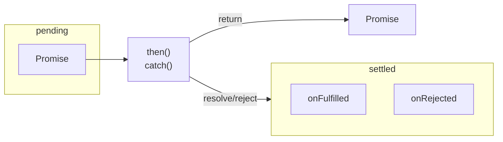

- `settled` 用來表示一個 promise 已被實現 (resolve) 或拒絕 (reject)，且其狀態不處於 `pending`。

- `_consumers` 用來存放調用 `then(onFulfilled, onRejected)` 或 `catch(onRejected)` 後產生的 promise，當 producer promise 狀態為 `settled` 則會向其所有 consumer 通知，並觸發在 consumer 中註冊的 `onFulfilled` 或 `onRejected` callback。

- `onFulfilled` 或 `onRejected` 不為 function 則忽略 (沿用 producer promise 的狀態)

- `x` 為調用 `onFulfilled` 或 `onRejected` 後的回傳值，若 `x` 為 promise，將採用 `x` 的狀態

```js
// promise states
const states = {
  pending: 0,
  fulfilled: 1,
  rejected: 2,
};

// helper functions
const getNextTick = () => {
  if (typeof queueMicrotask === 'function') {
    return (callback) => queueMicrotask(callback);
  }
  
  if (Promise) {
    return (callback) => Promise.resolve().then(callback);
  }
  
  if (typeof process !== 'undefined'
    && typeof process.nextTick === 'function'
  ) {
    return process.nextTick;
  }
  
  return (callback) => setTimeout(callback, 0);
};

const checkIsIterable = (target) => {
  return !!target && typeof target[Symbol.iterator] === 'function';
};

const checkIsThenable = (target) => {
  return !!target
    && !!target.then
    && typeof target.then === 'function';
};

// promise implementation
class DemoPromise {
  constructor(executor) {
    if (typeof executor !== 'function') {
      throw new TypeError('Promise resolver undefined is not a function');
    }
    
    this._state = states.pending;
    this._value = undefined;
    this._onFulfilled = undefined;
    this._onRejected = undefined;
    this._consumers = [];
    
    try {
      executor(this._resolvePromise, this._rejectPromise);
    } catch(error) {
      this._rejectPromise(error);
    }
  }
  
  _resolvePromise = (value) => {
    // 2.3.1
    if (value === this) {
      throw new TypeError('Chaining cycle detected for promise');
    }

    if (this._state === states.pending) {
      this._state = states.fulfilled;
      this._value = value;
      this._broadcast();
    }
  }
  
  _rejectPromise = (reason) => {
    if (this._state === states.pending) {
      this._state = states.rejected;
      this._value = reason;
      this._broadcast();
    }
  }
  
  _broadcast = () => {
    if (this._state === states.pending) {
      return;
    }
    
    const nextTick = getNextTick();
    
    nextTick(() => {
      while (this._consumers.length) {
        const consumer = this._consumers.shift();
        const resolver = this._state === states.fulfilled
          ? consumer._resolvePromise
          : consumer._rejectPromise;
        const callback = this._state === states.fulfilled
          ? consumer._onFulfilled
          : consumer._onRejected;
        const hasCallback = typeof callback === 'function';

        if (!hasCallback) {
          resolver(this._value);
          return;
        }

        const nextValue = callback(this._value);
        const isThenable = checkIsThenable(nextValue);

        if (!isThenable) {
          resolver(nextValue);
          return;
        }

        // 2.3.2
        nextValue.then(consumer._resolvePromise, consumer._rejectPromise);
      }
    })
  }
  
  then = (onFulfilled = undefined, onRejected = undefined) => {
    const nextPromise = new DemoPromise(() => {});

    nextPromise._onFulfilled = onFulfilled;
    nextPromise._onRejected = onRejected;
    this._consumers.push(nextPromise);
    this._broadcast();
    
    return nextPromise;
  }
  
  catch = (onRejected) => {
    return this.then(undefined, onRejected);
  }
  
  static race(iterable) {
    if (!checkIsIterable(iterable)) {
      throw new TypeError('not a iterable');
    }
    
    const iterableArray = Array.from(iterable);
    return new DemoPromise((resolve, reject) => {
      iterableArray.forEach((element) => {
        if (checkIsThenable(element)) {
          element.then(resolve, reject);
        } else {
          resolve(element);
        }
      });
    });
  }
  
  static all (iterable) {
    if (!checkIsIterable(iterable)) {
      throw new TypeError('not a iterable');
    }
    
    const iterableArray = Array.from(iterable);
    return new DemoPromise((resolve, reject) => {
      let completedCount = 0;
      const result = [];
      const setResult = (index, value, totalCount) => {
        completedCount += 1;
        result[index] = value;
        if (completedCount === totalCount) {
          resolve(result);
        }
      }

      iterableArray.forEach((element, index, { length }) => {
        if (!checkIsThenable(element)) {
          setResult(index, element, length);
          return;
        }
        element.then((value) => setResult(index, value, length), reject);
      });
    });
  }
  
  static resolve(value) {
    return new DemoPromise((resolve, reject) => resolve(value));
  }
  
  static reject(reason) {
    return new DemoPromise((resolve, reject) => reject(reason));
  }
}
```

## Reference

[Promises/A+](https://promisesaplus.com/)

[Basic Javascript promise implementation attempt](https://stackoverflow.com/questions/23772801/basic-javascript-promise-implementation-attempt/23785244)

[MDN - Promise](https://developer.mozilla.org/en-US/docs/Web/JavaScript/Reference/Global_Objects/Promise)

[MDN - Array from](https://developer.mozilla.org/zh-TW/docs/Web/JavaScript/Reference/Global_Objects/Array/from)

[JavaScript Promise | 從 Promises/A+ 規範瞭解 Promise](https://medium.com/%E6%89%8B%E5%AF%AB%E7%AD%86%E8%A8%98/promises-a-plus-330dda203569)
