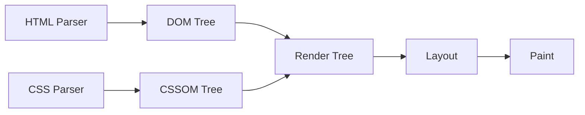

一句話表示網頁效能優化

> Do fewer things in every possible layers.

網頁效能是個很廣泛且涉及到很多層面的問題，像是系統架構、產品設計、商業模式、業務需求、過去的歷史共業 ... 等等。

上述的項目中，可能就跨足了 Infra, Backend, Frontend, Design, Marketing ... 部門，而不同部門之間又有各自的問題、考量，在這些因素的權衡取捨下或是一些程式上的瑕疵，都會對效能產生影響，例如

- Frontend
  - 發出請求時沒處理好 Request Headers, Request Body，導致 Server 誤判造成額外開銷
  - [Async Await Hell](https://www.freecodecamp.org/news/avoiding-the-async-await-hell-c77a0fb71c4c/)
  - Rendering Issues
- Backend
  - 犧牲效能來確保安全性、資料一致性
  - 過去糟糕的 Schema 、技術債，老子改不動
- Marketing
  - 因廣告需求，在網站上把 Hero Image 大版面的圖片塞好塞滿
  - 需要多個 Analytics Tools 追蹤 Bounce Rate, Session Time, Revenue, Checkouts ... 指標
- Business Scenarios
  - 商品需要顯示購買人數的需求，是要以即時資料還是一個時間區間內的暫存資料即可，是否扣除退貨訂單數量 ... 等

綜觀來說，前端只是網頁效能中的一部分，但身為前端工程師，當有效能疑慮時，老闆第一時間可能會先抓你來噴一頓，此時能夠釐清問題、找出哪個階段為效能瓶頸，才能釐清究竟是自己還是別人在雷，進而解決問題或是把鍋甩給別人。

這裡主要在記錄一些 Web 前端在效能上的指標及優化的大方向，大部分內容參考自英文的簡報、文章，個人認為原文方式更能清楚表達，索性就不另外寫成中文了，相關連結會附在文末。

## Why is Performance Important

這裡不談高大上的結論像是

- 載入速度每減少 1 秒，轉換率 (CVR) 提升 2%
- 載入速度每減少 100 毫秒，營收提升 1%

第一點是我無法從這些統計數據，看出效能優化對轉換率與營收之間的因果關係，即使效能未改善，甚至變差但營收或轉換率上升的情況還是有可能的。

第二點是這些數據為市面上大公司的統計成果，未必適用在你目前負責的產品上。若有實際收集的 field data 與 business data 分析後的數據，可能更適合作為此產品商業決策上的依據，但不是每間公司 data team 或是相應的資源來處理。

我認為更好的理由是

- Google 說很重要，還會依此結果進行排名
- 老闆會去跟競品比較，如果分數出來比對手還低，日子可能不好過

## Perceived Performance

先談 Perceived performance，簡單來說為用戶對網站速度的主觀感受的指標

因為重在使用者體驗，我們可以根據下列幾項原則，進一步分散用戶在等待時的注意力，提升感知的載入時間

- People want to start
- People will wait for value
- Bored waits feel slower
- Anxious waits feel slower
- Unexplained waits feel slower
- Uncertain waits feel slower

常見的例子像是

- Medium (blog platform) loading low quality pictures first and then replacing them higher quality pictures.
- Skeleton loading first and replace skeleton objects immediately when the data is available. (Youtube, etc)
- Loading state designs (button state, loading dialog, spinner, etc)

透過 UI 向使用者指示正在載入中，或是某個區塊正在載入何種內容（圖片、文字等 ... ），及避免內容載入後，造成非用戶預期的版面位移。

## Where do we Measure from

### Lab Data

Lab data is performance data collected within a controlled environment with the predefined device and network settings. This offers reproducible results and debugging capabilities to help identify, isolate, and fix performance issues.

- Chrome Dev Tools
- Lighthouse
- [lightest.app](https://www.lightest.app/)
  - Web performance visualization and comparison tool. Analyze website loading against competitors.

### Field Data

Field data is performance data collected from real page loads your users are experiencing in the wild.

- [Chrome UX Report Compare Tool](https://crux-compare.netlify.app/)
- [PageSpeed Insights](https://developers.google.com/speed/pagespeed/insights/)

## Web Vitals

Web Vitals is an initiative by Google to provide unified guidance for quality signals that are essential to delivering a great user experience on the web.

### Time to First Bite (TTFB)

How long the browser has to wait before receiving its first byte of data from the server.

發出請求後，接收到 Server 回傳的第一個 Byte 時間，包含 TCP 連結時間、HTTP 請求時間。

Server Side Rendering 的架構，TTFB 時間很大一部分取決於 API 的效能。

#### Optimizing Metrics

- Reduce the amount of work required to render pages
- Check API calls
  - Sure it’s necessary.
  - Check query parameters, request headers, request body, .
- Maybe we don't need dynamic content.
  - Static Site / JAMstack

### First Contentful Paint (FCP)

The time until the user sees an indication that the page is loading.

（瀏覽器繪製出第一個內容的時間）

#### Optimizing Metrics

- Quick servers
  - sized correctly (e.g. have enough overhead in the machines)
  - minimal processing
  - network bandwidth
- Small documents
  - Content size
  - compression
- Short Transmission
  - depend on your infrastructure

### Largest Contentful Paint (LCP)

The time until user sees most of the page and believes it is ready.

（每當頁面出現一個比當前 LCP 更大的元素就會取代為新的 LCP，直到使用者開始和網頁互動為止。）

#### Optimizing Metrics

- Defer resources until later (We don't need right away)
  - Lazy loading, e.g.
    - loading current locale css font
    - images
    - code splitting
  - Tree shaking
- Optimize images
  - Responsive images
  - Crunching the images
- Reduce request overhead (DNS, TCP, SSL, Request, Response, Processing)
  - Cached Request
  - HTTP/2 (Reuse connection)
  - Preconnect, DNS-prefetch, e.g.
    - `<link rel="preconnect" href="https://fonts.gstatics.com">`

### Cumulative Layout Shift (CLS)

The movement distance and impact of page elements during the entire lifetime of the document the user sees.

（計算載入網頁元素時的非預期位移，像是圖片載入後造成的版面位移。像 Dropdown, Collapse 這類的網頁元素，與使用者互動後發生選項視窗彈出、內容收合發生的版面位移，則視為可預期的位移）

#### Optimizing Metrics

- CSS aspect ratio placeholder
- Never insert content above existing content, except in response to user interaction.
- Ensure the browser knows how much space to allocate for an image is simply to define its width and height, Modern browser will now take those values into consideration and remove all the jank before the image has loaded.

```html
<style>
img.is-responsive {
  width: 100%;
  height: auto;
}
</style>

<picture>
  <source srcset="~static/image/amazon.webp" type="image/webp" />
  
</picture>
```

### First Input Delay (FID)

The browser time delay between the user's first click and execution of application code.
（瀏覽器完成主線程後，開始執行使用者互動事件的時間）

## Get Performance Information Programmatically

下方為如何在 client side 收集真實的 web vitals，並向指定 api 端點發送資料的示意程式碼

[code resource](https://github.com/toddhgardner/perf-training-website/blob/perf-complete/public/assets/js/util/perf.js)

- `new PerformanceObserver().observe({ buffered: true })`
  - `buffered` it means give the events event if they already happended

- The `navigator.sendBeacon()` method asynchronously sends a small amount of data over HTTP to a web server.
  - not supported for all browser
  - will sending a POST request

```javascript
(function (ready) {
  if (document.readyState === "complete" || document.readyState === "interactive") {
    ready();
  } else {
    document.addEventListener("readystatechange", function() {
      if (document.readyState === "complete") {
        ready();
      }
    });
  }
})(function perf() { /* the document is now complete. */

  var data = {
    url: window.location.href,
    dcl: 0,
    load: 0,
    fcp: 0,
    lcp: 0,
    cls: 0,
    fid: 0
  };

  var fcpObserver = new PerformanceObserver(function handleFCP(entryList) {
    var entries = entryList.getEntries() || [];
    entries.forEach(function(entry) {
      if (entry.name === "first-contentful-paint") {
        data.fcp = entry.startTime;
        console.log("Recorded FCP Performance: " + data.fcp);
      }
    });
  }).observe({ type: "paint", buffered: true });

  var lcpObserver = new PerformanceObserver(function handleLCP(entryList) {
    var entries = entryList.getEntries() || [];
    entries.forEach(function(entry) {
      if (entry.startTime > data.lcp) {
        data.lcp = entry.startTime;
        console.log("Recorded LCP Performance: " + data.lcp);
      }
    });
  }).observe({ type: "largest-contentful-paint", buffered: true });

  var clsObserver = new PerformanceObserver(function handleCLS(entryList) {
    var entries = entryList.getEntries() || [];
    entries.forEach(function(entry) {
      if (!entry.hadRecentInput) {
        data.cls += entry.value;
        console.log("Increased CLS Performance: " + data.cls);
      }
    });
  }).observe({ type: "layout-shift", buffered: true });

  var fidObserver = new PerformanceObserver(function handleFID(entryList) {
    var entries = entryList.getEntries() || [];
    entries.forEach(function(entry) {
      data.fid = entry.processingStart - entry.startTime;
      console.log("Recorded FID Performance: " + data.fid);
    });
  }).observe({ type: "first-input", buffered: true });

  window.addEventListener("beforeunload", function() {
    var navEntry = performance.getEntriesByType("navigation")[0];
    data.dcl = navEntry.domContentLoadedEventStart;
    data.load = navEntry.loadEventStart;

    var payload = JSON.stringify(data);
    navigator.sendBeacon("/api/perf", payload);
    console.log("Sending performance:", payload);
  });
});
```

## Rendering Performance

### The Render Tree

Optimizing the critical rendering path is the process of minimizing the total amount of time spent performing steps in the above sequence



- Process HTML markup and build the DOM tree.
- Process CSS markup and build the CSSOM tree.
- Combine the DOM and CSSOM into a render tree.
- Run layout on the render tree to compute the exact position and size of each node.
- Paint the individual nodes to the screen.

### Reducing Render Blocking Time

Render blocking means that these JavaScript or CSS Resources are slowing down your browser parse render tree.

- Whenever the parser encounters a script it has to stop and execute it before it can continue parsing the HTML.
- CSS is a render blocking resource. Get it to the client as soon and as quickly as possible to optimize the time to first render.
- Lazy loading cause render blocking resources
- Web font (fetch & alter when content loaded, useful for chinese fonts)
- Third party library code, only load when they needed e.g. zendesk, youtube iframe sdk ....

###  Minimizing Browser Relayout

Relayout is the name of the web browser process for re-calculating the positions and geometries of elements in the document, Occurs when you

- insert, remove or update an element in the DOM
- modify content on the page, e.g. the text in an input box
- move a DOM element
- animate a DOM element
- take measurements of an element such as offsetHeight or getComputedStyle
- change a CSS style
- change the className of an element
- add or remove a stylesheet
- resize the window

### Avoid Forced Synchronous Layout (Layout Thrashing)

Layout Thrashing occurs when JavaScript violently writes, then reads, from the DOM, multiple times causing document reflows.

The browser is lazy and wants to wait until the end of current operation (or frame) to perform this reflow.

- Do not put the browser into a read-write-read-write cycle.
- Batches your reads and writes manipulate.

```javascript
// Read
var h1 = element1.clientHeight;
var h2 = element2.clientHeight;
var h3 = element3.clientHeight;

// Write (invalidates layout)
element1.style.height = (h1 * 2) + 'px';
element2.style.height = (h2 * 2) + 'px';
element3.style.height = (h3 * 2) + 'px';

// Document reflows at end of frame
```

- [fastdom](https://github.com/wilsonpage/fastdom)

## Reference 

[Frontend Masters - Web Performance Fundamentals](https://frontendmasters.com/courses/web-perf/)

[重新學習瀏覽器資源載入機制，這些年努力改善電商網站效能的旅程](https://jason-memo.dev/posts/relearn-browser-loading-resoure-improve-ec-site-performance-journey/)

[Web Vitals](https://web.dev/vitals/)

[How To Think About Speed Tools](https://developers.google.com/web/fundamentals/performance/speed-tools/)

[MDN - Perceived performance](https://developer.mozilla.org/en-US/docs/Learn/Performance/Perceived_performance)

[MDN - PerformanceObserver.observe()](https://developer.mozilla.org/en-US/docs/Web/API/PerformanceObserver/observe)

[MDN - Navigator.sendBeacon()](https://developer.mozilla.org/en-US/docs/Web/API/Navigator/sendBeacon)

[MDN - Lazy loading](https://developer.mozilla.org/en-US/docs/Web/Performance/Lazy_loading)

[Preventing 'layout thrashing'](https://blog.wilsonpage.co.uk/preventing-layout-thrashing/)

[eleventy-high-performance-blog](https://github.com/google/eleventy-high-performance-blog)
