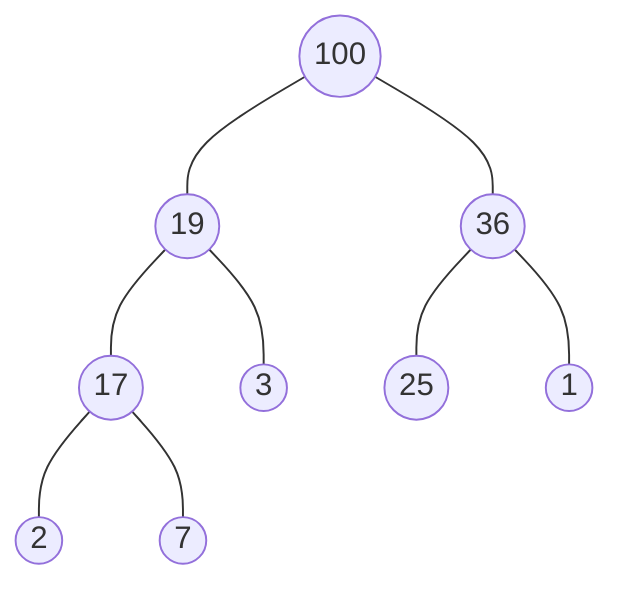
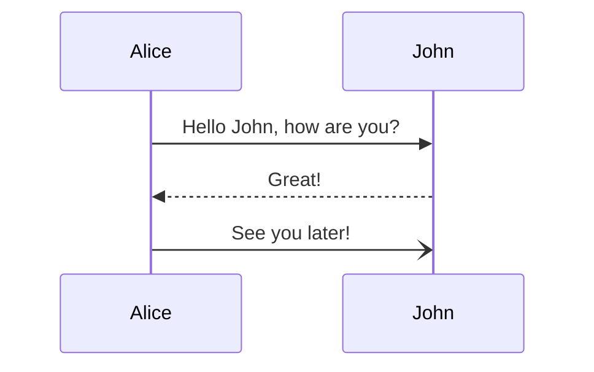

# Mermaid syntax

Using Mermaid syntax in Markdown:

````mdx

```mermaid
graph TB
  root((100))---left((19))
  root---right((36))
  left---left_left((17))
  left---left_right((3))
  right---right_left((25))
  right---right_right((1))
  left_left---left_left_left((2))
  left_left---left_left_right((7))
```
````


```mermaid
graph TB
  root((100))---left((19))
  root---right((36))
  left---left_left((17))
  left---left_right((3))
  right---right_left((25))
  right---right_right((1))
  left_left---left_left_left((2))
  left_left---left_left_right((7))
```

````mdx

```mermaid
sequenceDiagram
  Alice->>John: Hello John, how are you?
  John-->>Alice: Great!
  Alice-)John: See you later!
```
````


```mermaid
sequenceDiagram
  Alice->>John: Hello John, how are you?
  John-->>Alice: Great!
  Alice-)John: See you later!
```
