# Heap sort

流程：
1. 透過 [heapify](#heapify) 將陣列轉換為 [heap](#heap) 結構
1. 以遞增排序為例，透過 max-heap 的性值，將第一筆與最後一筆元素交換，即確定了排序後的位置
1. 排除已排序的元素，重複上述步驟直到 max-heap size 為 1

```js --n
heapSort([5, 3, 2, 10, 1, 9, 8, 6, 4, 7]);

function heapSort(array) {
  for (let i = Math.floor(array.length / 2) - 1; i >= 0; i--) {
    maxHeapify(array, i, array.length);
  }

  for (let i = array.length - 1; i > 0; i--) {
    const lesser = array[i];
    array[i] = array[0];
    array[0] = lesser;
    maxHeapify(array, 0, i);
  }

  return array;
}

// !collapse(1:25) collapsed
function maxHeapify(array, index, heapSize) {
  const leftIndex = 2 * index + 1;
  const rightIndex = 2 * index + 2;
  let largestValueIndex = index;

  if (
    heapSize > leftIndex && 
    array[largestValueIndex] < array[leftIndex]
  ) {
    largestValueIndex = leftIndex;
  }

  if (
    heapSize > rightIndex && 
    array[largestValueIndex] < array[rightIndex]
  ) {
    largestValueIndex = rightIndex;
  }

  if (index !== largestValueIndex) {
    const largest = array[largestValueIndex];
    array[largestValueIndex] = array[index];
    array[index] = largest;
    maxHeapify(array, largestValueIndex, heapSize);
  }
}
```

## Heap

- 完全二元樹 (complete binary tree)
- 由上至下、由左至右的順序加入節點
- max-heap: 所有父節點的值大於其子節點 (min-heap 則相反)

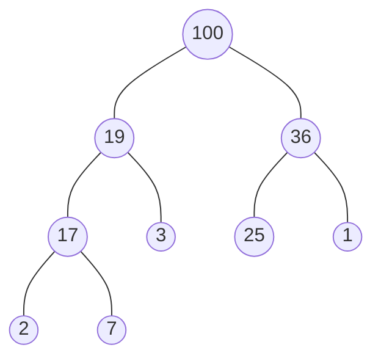

以上圖 max-heap 為例：

- 以陣列表示為 `[100, 19, 36, 17, 3, 25, 1, 2, 7]`
- 節點 `i` 的左子節點為 `2i + 1`
- 節點 `i` 的右子節點為 `2i + 2`

## Heapify

將無序陣列轉換成 heap 的過程稱為 heapify，其流程如下：

1. 由最後非葉子節點開始，對每個節點 heapify 子樹，確保每個子樹符合 heap 性質
1. 以 max-heap 為例，比較父節點、左子節點、右子節點的最大值，若父節點不是最大值，交換位置並往下檢查子樹

```js --n
// create max-heap
const nums = [5, 3, 2, 10, 1, 9, 8, 6, 4, 7];

// Math.floor(nums.length / 2) - 1 is the last non-leaf node index
for (let i = Math.floor(nums.length / 2) - 1; i >= 0; i--) {
  maxHeapify(nums, i, nums.length);
}

function maxHeapify(array, index, heapSize) {
  const leftIndex = 2 * index + 1;
  const rightIndex = 2 * index + 2;

  let largestValueIndex = index;

  if (heapSize > leftIndex && array[largestValueIndex] < array[leftIndex]) {
    largestValueIndex = leftIndex;
  }

  if (heapSize > rightIndex && array[largestValueIndex] < array[rightIndex]) {
    largestValueIndex = rightIndex;
  }

  if (index !== largestValueIndex) {
    const largest = array[largestValueIndex];
    array[largestValueIndex] = array[index];
    array[index] = largest;
    maxHeapify(array, largestValueIndex, heapSize);
  }
}
```

### Step by step

逐步說明下方範例 loop 過程：
- 紅色表示參與比對節點
- 綠色表示實際更新節點

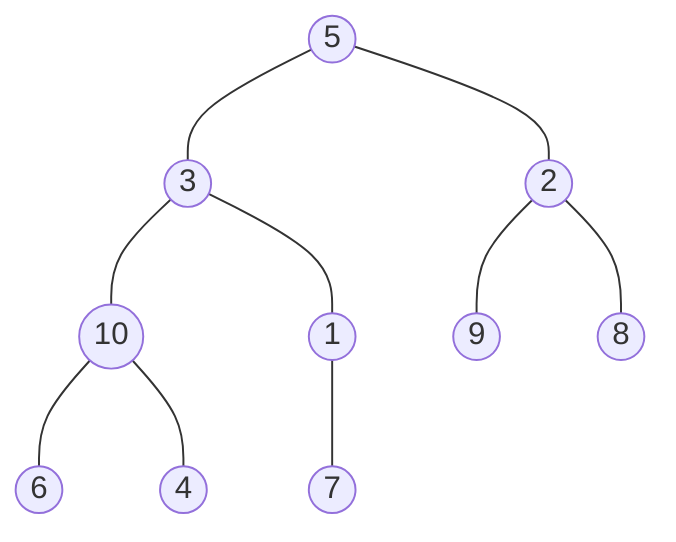

```text
nums = [5, 3, 2, 10, 1, 9, 8, 6, 4, 7]
```

**Step 1:**

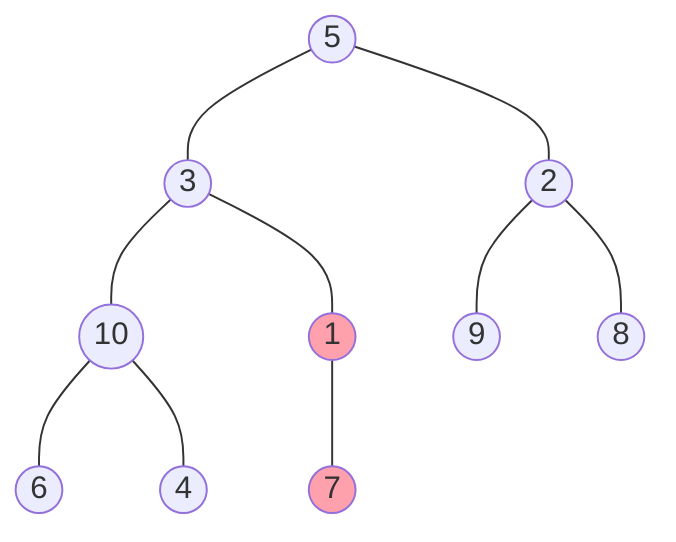

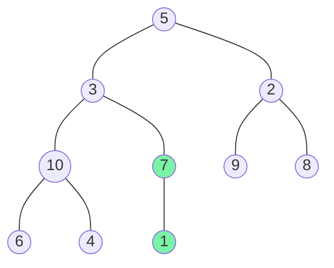

```text
nums = [5, 3, 2, 10, 1, 9, 8, 6, 4, 7]
i = 4
parentValue = 1

leftIndex = 9 (2i + 1)
leftValue = 7

rightIndex = 10 (2i + 2)
rightValue ignored since out of bound

swap 1 and 7
nums = [5, 3, 2, 10, 7, 9, 8, 6, 4, 1]
check subtree rooted at index 9

---

index 9 is a leaf node, stop
```

**Step 2:**

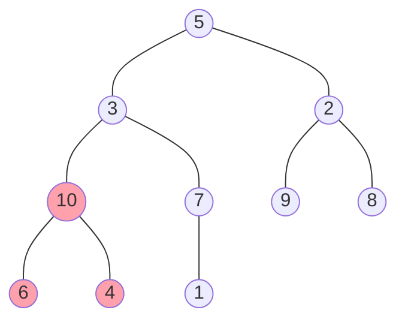

```text
nums = [5, 3, 2, 10, 7, 9, 8, 6, 4, 1]
i = 3
parentValue = 10

leftIndex = 7 (2i + 1)
leftValue = 8

rightIndex = 8 (2i + 2)
rightValue = 6

no swap needed
```

**Step 3:**

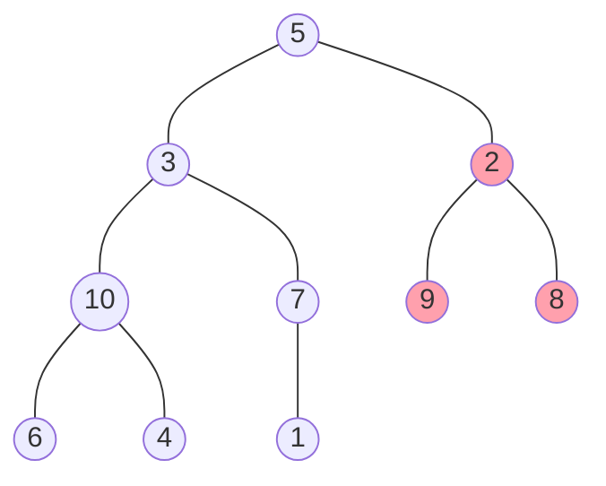

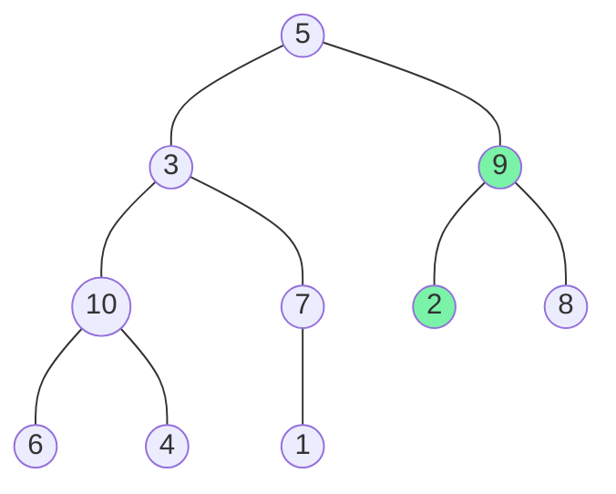

```text
nums = [5, 3, 2, 10, 7, 9, 8, 6, 4, 1]
i = 2
parentValue = 2

leftIndex = 5 (2i + 1)
leftValue = 9

rightIndex = 6 (2i + 2)
rightValue = 8

swap left child 9 and parent 2
nums = [5, 3, 9, 10, 7, 2, 8, 6, 4, 1]
check subtree rooted at index 5

---

index 5 is a leaf node, stop
```

**Step 4:**

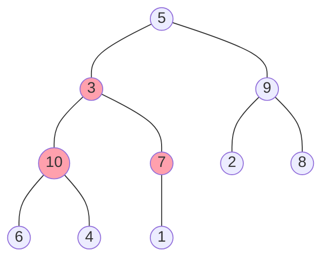

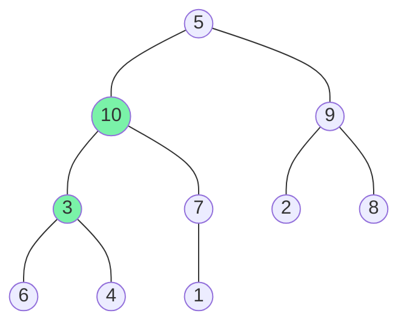

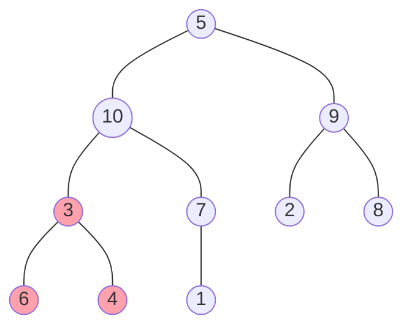

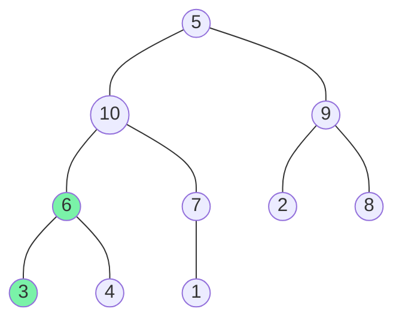

```text
nums = [5, 3, 9, 10, 7, 2, 8, 6, 4, 1]
i = 1
parentValue = 3

leftIndex = 3 (2i + 1)
leftValue = 10

rightIndex = 4 (2i + 2)
rightValue = 7

swap left child 10 and parent 3
nums = [5, 10, 9, 3, 7, 2, 8, 6, 4, 1]
check subtree rooted at index 3

---

i = 3
parentValue = 3

leftIndex = 7 (2i + 1)
leftValue = 6

rightIndex = 8 (2i + 2)
rightValue = 4

swap left child 6 and parent 3
nums = [5, 10, 9, 6, 7, 2, 8, 3, 4, 1]
check subtree rooted at index 7

---

index 7 is a leaf node, stop
```

**Step 5:**

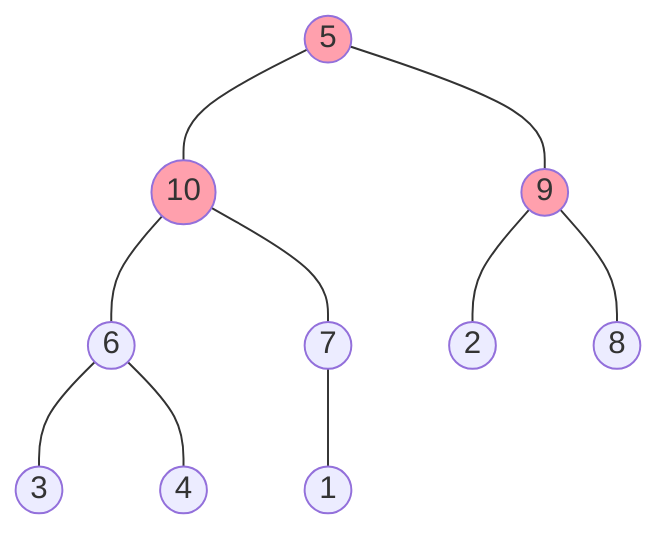

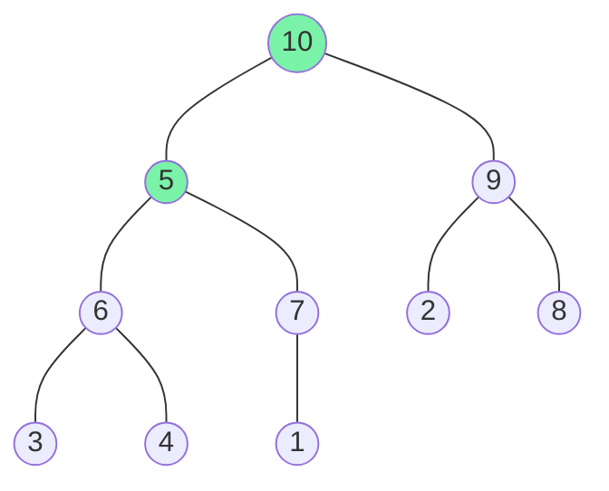

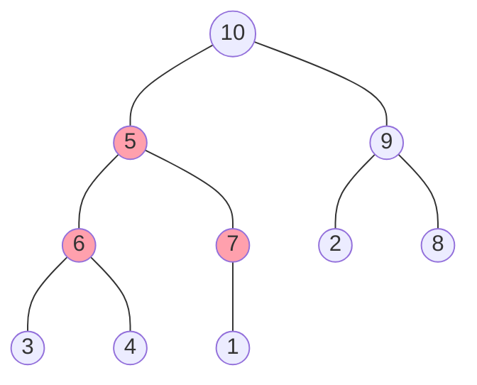

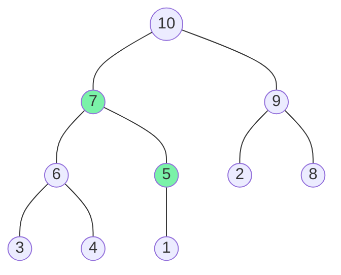

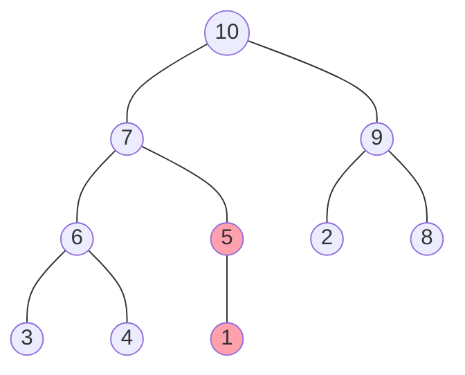

```text
nums = [5, 10, 9, 6, 7, 2, 8, 3, 4, 1]
i = 0
parentValue = 5

leftIndex = 1 (2i + 1)
leftValue = 10

rightIndex = 2 (2i + 2)
rightValue = 9

swap left child 10 and parent 5
nums = [10, 5, 9, 6, 7, 2, 8, 3, 4, 1]
check subtree rooted at index 1

---

i = 1
parentValue = 5

leftIndex = 3 (2i + 1)
leftValue = 6

rightIndex = 4 (2i + 2)
rightValue = 7

swap right child 7 and parent 5
nums = [10, 7, 9, 6, 5, 2, 8, 3, 4, 1]
check subtree rooted at index 4

---

i = 4
parentValue = 5

leftIndex = 9 (2i + 1)
leftValue = 1

rightIndex = 10 (2i + 2)
rightValue ignored since out of bound

no swap needed
```

## References

- [Build-Max-Heap: Why Start i at floor(A.length/2) rather than A.length?](https://cs.stackexchange.com/questions/71786/build-max-heap-why-start-i-at-floora-length-2-rather-than-a-length)
- [Complete Intro to Computer Science - Heap Sort](https://btholt.github.io/complete-intro-to-computer-science/heap-sort)
