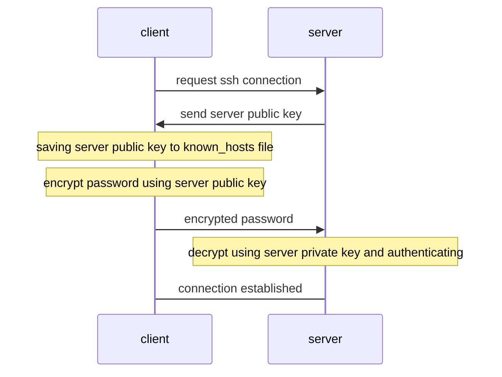
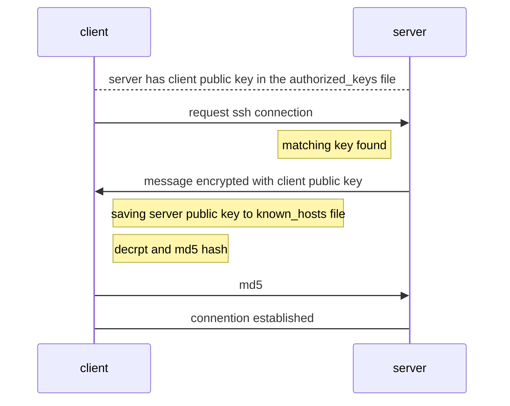

# Quick overview of SSH

>The SSH protocol uses encryption to secure the connection between a client and a server. All user authentication, commands, output, and file transfers are encrypted to protect against attacks in the network.

## Cliet-server model

- client 需要有 ssh program 負責發送 connection request
- server 運行一個 ssh daemon，負責監聽 ssh connection request (預設 TCP port22)

## Public key cryptography
  
- 一個 public key 對應一個 private key
- public key 加密資料、驗證簽名
- private key 解密資料、簽名（signature）

### Signature

signature 確保資料傳輸的能符合

- 資料在傳輸過程中不會被篡改
- 確實是從持有 private key 的來源所發佈

簡易流程如下

1. 將要傳送的資料 hash 後，以 private key 進行加密，得到簽名 (signature)
1. 將簽名與資料一同送出
1. 收到資料與簽名後，以同樣的 hash 方式將資料轉為 hash value
1. 透過公鑰解開簽名，比對步驟 3 的 hash value
  
## Password authentication

未將 client 端的 public key 加至 server `.ssh/authorized_keys`

```bash
ssh <username>@<remote_host>
# specify the port
ssh -p 2222 <username>@<remote_host>
```



## Public key authentication

generating ssh keys

```bash
ssh-keygen -t rsa
# hit enter to put the key files in the default place
# hit enter to give an empty passphrase
# hit enter again to confirm
```

add the public key to server machine

```bash
mkdir ~/.ssh
vi ~/.ssh/authorized_keys # paste in client public key
chmod 700 ~/.ssh
chmod 600 ~/.ssh/authorized_keys
```

connecting to server

```bash
ssh <username>@<remote_host>
```



## References

- [Complete Intro to Linux and the CLI - SSH](https://btholt.github.io/complete-intro-to-linux-and-the-cli/ssh)
- [SSH (Secure Shell)](https://www.ssh.com/academy/ssh#the-ssh-protocol)
- [筆記 - 加解密與數位簽章](https://sibevin.github.io/posts/2017-05-19-113900-notes-encryption-digital-signature)
- [RSA數位簽章的簡單流程](https://dotblogs.com.tw/litfal/2014/03/08/144298)
