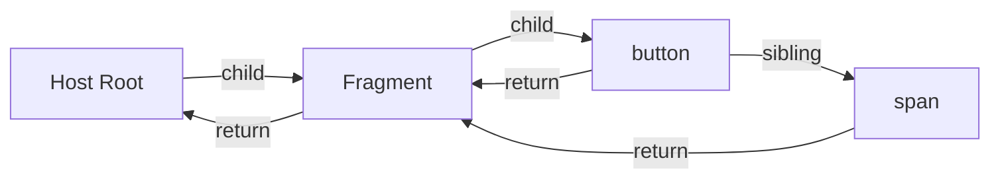
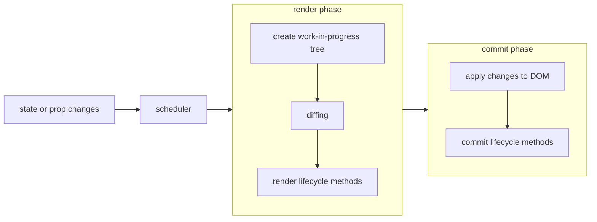

## Fiber nodes

- Every React element has a corresponding fiber node. Unlike React elements, fibers aren’t re-created on every render. These are mutable data structures that hold components state and DOM.
- All fiber nodes are connected through a linked list using the following properties on fiber nodes: `child`, `sibling` and `return`.

```tsx
function Counter() {
  const [count, setCount] = useState(0);
  return (
    <React.Fragment>
      <button>increase</button>
      <span>{count}</span>
    </React.Fragment>
  );
}
```



## Current tree and work-in-progress tree

- After the first render, React ends up with a fiber tree that reflects the state of the application. This tree is often referred to as current tree.
- When React starts working on updates it builds a so-called work-in-progress tree.
- Each node in the work-in-progress tree has an alternate reference to its corresponding node in the current tree.
- React uses the work-in-progress tree to efficiently determine the minimal set of changes needed to update the UI.
- After the reconciliation process, React commits the changes to the DOM, the work-in-progress tree now becomes the new current tree
- A depth-first traversal to create the work-in-progress tree

## Effect list

- The effect list is a linked list attached to the work-in-progress tree.
- Each fiber node in the work-in-progress tree can have pointers to the first and last effect in a list of effects it needs to apply.
- The fibers with side-effects are linked in the effect list using their `nextEffect` pointers.
- After reconciliation, React enters the commit phase, where it processes the effect list to apply side-effects.

## Render phase

- This is when React determines what changes need to be made to the actual DOM.
- The render phase is performed asynchronously for:
  - **Avoid blocking the main thread**
  - **Incremental Rendering** (break down the rendering work into smaller chunks and spread them out over multiple frames. This approach, known as "time-slicing," prevents long-running tasks from freezing the UI.)
  - **Concurrent Features** (enables work on multiple tasks simultaneously and prioritizes updates based on their urgency. Less critical updates can be deferred.)
- Always starts from the topmost `HostRoot` fiber node. However, React bails out of (skips) already processed fiber nodes until it finds the node with unfinished work.
- React invokes the component's `render` method and other lifecycle methods like `getDerivedStateFromProps` and `shouldComponentUpdate`.

Additional information:

- [Why does purity matter?](https://react.dev/reference/rules/components-and-hooks-must-be-pure#how-does-react-run-your-code)

## Commit phase

- This phase is where React works with the real DOM, and side effects can occur.
- After the DOM has been updated, React calls certain lifecycle methods where side effects can occur, such as `componentDidMount`, `componentDidUpdate`, and `componentWillUnmount`.

## Higher-level overview



## Reference

- [Inside Fiber: an in-depth overview of the new reconciliation algorithm in React](https://blog.ag-grid.com/inside-fiber-an-in-depth-overview-of-the-new-reconciliation-algorithm-in-react/)
- [Why does purity matter?](https://react.dev/reference/rules/components-and-hooks-must-be-pure#how-does-react-run-your-code)
